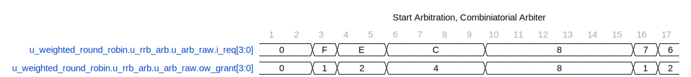
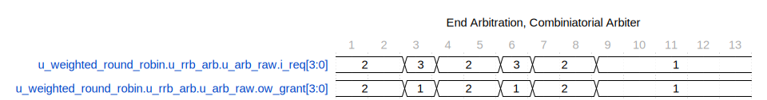
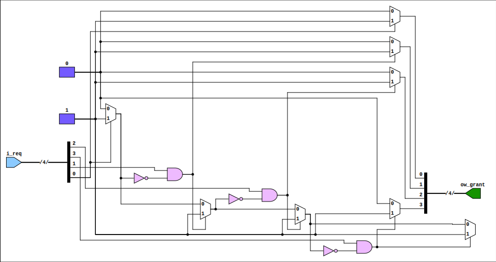

`arbiter_fixed_priority` is a SystemVerilog module located at `rtl/common/arbiter_fixed_priority.sv`. This module implements a fixed-priority arbiter that grants access to several clients based on a fixed-priority scheme, where lower-indexed clients have higher priority. It is parameterized for easy scalability.

## Functionality

- **Clients (`CLIENTS`):** The module is parameterized with an integer `CLIENTS` to support a flexible number of clients. The default number of clients is set to 4 but is reconfigurable as needed.

- **Input Requests (`i_req`):** An array of request signals from each client, where the array index corresponds to the client ID. A '1' indicates that the client is requesting access.

- **Output Grants (`ow_grant`):** An array of grant signals to each client, where only one client will be granted access at a time based on the fixed priority order.

## Operation

1. All grants are initially set to '0' at the beginning of each cycle.

2. The module checks each client's request signal, from client 0 (the highest priority) to `CLIENTS-1` (the lowest priority).

3. The first client (in priority order) that has an active request (`i_req[i]` is '1') and no other client has been granted access yet will be granted access by setting `ow_grant[i]` to '1'.

4. Once granted (`w_found` is '1'), no other grants will be issued during that cycle, ensuring only one client has access.

## Waveforms


In this waveform, all of the requests are asserted at the beginning. The requests get granted from bit 0 to bit N. We can see the lower bits, incrementally get masked out.


In this waveform, only req0 and req1 are asserting in the end. We see the arbiter ping back and for between the two, depending on their credit allowance.

## Diagram, assuming four clients



## Usage

To use this module, instantiate it in your SystemVerilog design and specify the `CLIENTS` parameter if a number other than the default is needed. Connect your client `i_req` signals to the inputs and route the `ow_grant` outputs to control logic that uses the arbitration result.

```verilog

arbiter_fixed_priority #( .CLIENTS(4) ) arb_inst (

.i_req(client_requests), // Replace with actual request signals

.ow_grant(client_grants) // Connect to arbiter-dependent logic

);

```

## Note

Ensure that the `timescale` directive (1ns / 1ps) matches the time unit and precision used in your design to ensure proper timing simulation.

---

## Block Hierarchy and Links

- [Weighted Round Robin](arbiter_weighted_round_robin)
- [Arbiter Sub Instance](arbiter_round_robin_subinst)
- [Arbiter Fixed Priority](arbiter_fixed_priority)

---

## Usage in tests

- TBD

---

[Return to Index](/docs/mark_down/rtl/)

---
