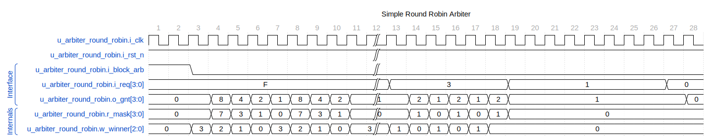

The `arbiter_round_robin` module implements a round-robin arbitration scheme to manage requests from multiple clients. Based on the round-robin arbitration logic, it outputs a grant signal to only one client at a time. The module provides fairness by rotating priority among the clients with each cycle.

## Parameters

- `CLIENTS`: The number of client signals to arbitrate. This integer parameter determines the size of the request and grant vectors.

## Ports

- `i_clk`: Input clock signal.

- `i_rst_n`: Active-low reset signal.

- `i_block_arb`: Input signal to block arbitration when high.

- `i_req`: Input request vector from clients, where each bit corresponds to a request signal from a client.

- `o_gnt`: Output grant vector to clients, where only one bit will be set to indicate the granted client.

## Internal Logic Description

The module comprises registers and combinatorial logic sections performing the following functions:

- **Request Masking**: Request signals (`i_req`) get masked to ignore already serviced clients and only to consider new requests or requests not granted in the current cycle.

- **Leading/Trailing One Detection**: Utilizing a sub-module called `leading_one_trailing_one`, the module detects the highest and lowest priority requests from the masked and unmasked request vectors.

- **Winner Selection**: The winner (granted client) is selected based on the valid request signals. If a valid request is found in the masked request signals, it takes precedence; otherwise, the unmasked winner is selected.

- **Winner Masking**: The `r_mask` register is updated based on the current winner to ensure the priority shifts correctly for the next cycle.

- **Grant Register**: The `o_gnt` register is updated to reflect the grant signal for the winner.

## Waveforms



All requests are pegged high in this start portion of the weighted round-robin. The grants start at the upper bit in this implementation and work their way down. In the later part of the simulation, the arbiter alternates between agent zero and agent one. Finally, when agent 1 runs out of requests, the arbiter sticks with agent 0 without injecting bubbles.

## Diagram, assuming four clients


### Code Snippets

```verilog

// Register: r_mask

// The r_mask depends on the previous winner.

always_ff @(posedge i_clk or negedge i_rst_n)

if (!i_rst_n) r_mask \<= '0;

else r_mask \<= ({(CLIENTS - 1)'('d0), 1'b1} \<\< w_winner) - 1'b1;

```

- The module also includes simulation constructs enclosed within `synopsys translate_off` and `synopsys translate_on` to initialize the waveform dump in `waves.vcd` for debugging purposes.

### Synthesis Considerations

- The initial block with `\$dumpfile` and `\$dumpvars` is specifically for simulation and will not be synthesized. It is commonly wrapped in translation directives, so synthesis tools ignore this block.

## Usage

To use the `arbiter_round_robin` module, instantiate it in your RTL design, parameterize the `CLIENTS` as required, and connect the inputs and outputs to your system's clock, reset, request, and grant lines, respectively.

## Additional Notes

This documentation assumes familiarity with Verilog and round-robin arbitration concepts. The module may depend on submodules like `leading_one_trailing_one`, which are not included in this documentation but would need to be defined elsewhere in the project.

---

---

[Return to Index](/docs/mark_down/rtl/)

---
