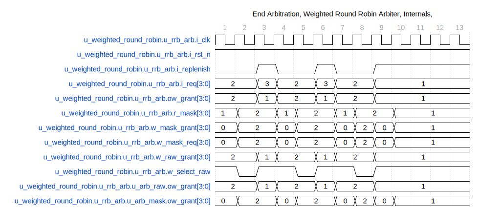
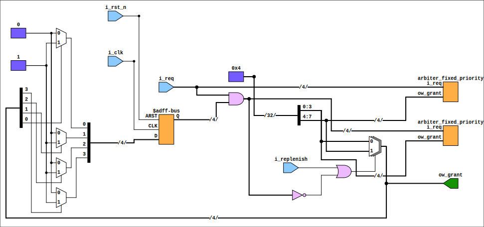

This documentation is for the `arbiter_round_robin_subinst` block, which is part of a round-robin arbiter module described in a SystemVerilog file typically located at `rtl/common/arbiter_round_robin_subinst.sv`. The original concept is from an online source, [Chipress](https://chipress.online/2019/06/23/round-robin-arbiter-the-wrong-design-and-the-right-design/), with modifications to parameterize the design and introduce bug fixes and performance enhancements to the original code.

## Code Description

The `arbiter_round_robin_subinst` is a parameterized module taking the following inputs and output:

### Inputs

- `i_clk`: Clock input that synchronizes the arbiter's operation.

- `i_rst_n`: Active low reset signal used to reset the internal state of the arbiter.

- `i_req: A CLIENTS-bit-wide bus representing requests from various clients.

- `i_replenish`: A control signal determining the arbiter's prioritization behavior.

### Outputs

- `ow_grant: A CLIENTS-bit-wide bus produces the grant output for the client's requests.

### Parameters

- `CLIENTS`: The number of clients to be supported by the arbiter.

### Internals

- `r_mask`: A register holding the mask state determines clients' priority based on previous grants.

- `w_mask_req`: The masked request results from `i_req` ANDed with `r_mask`.

- `w_raw_grant`: Wire to hold the grant output if not masked.

- `w_mask_grant`: Wire to hold the grant output influenced by the `r_mask`.

- `w_select_raw`: A wire used to select between `w_raw_grant` and `w_mask_grant`.

The arbiter works round-robin, ensuring that client access starvation does not occur. It uses a fixed priority arbiter (not provided in the code snippet) that must be included in the design using the module name `arbiter_fixed_priority`. The module has two instantiations of `arbiter_fixed_priority`: one for raw requests and another for masked requests, where the mask prioritizes previously ungranted requests.

### Functionality

1. The module updates a mask register at every positive clock edge or on a reset. It sets all mask bits to '1' if reset is active. Their corresponding bits in the mask register are set for previously granted clients (`ow_grant` is high).

2. The arbiter computes masked requests by ANDing the incoming requests with the mask.

3. Two instances of the `arbiter_fixed_priority` arbiters are used:

   - `u_arb_raw` processes the raw input requests.
   - `u_arb_mask` processes the masked requests.

4. The final grant signal `ow_grant` is determined by the `w_select_raw` wire. If replenishment (`i_replenish`) is requested or all masked requests are '0', the raw grant output from `u_arb_raw` is selected; otherwise, the masked grant output from `u_arb_mask` is selected.

5. This round-robin implementation ensures that each client gets a fair chance of being serviced, and the arbitration is modified based on previous grants, which influences the prioritization of future requests.

To include and use this module within a larger Verilog project, ensure to instantiate it correctly and provide a fixed priority arbiter named `arbiter_fixed_priority`. The specifics of the `arbiter_fixed_priority` are not detailed here, and this module must be defined elsewhere in the design.

## Waveforms


In this waveform, we notice ow_grant cycles from agent 0 to agent 3, each with more extended grant periods. The grant periods 1, 2, 4, and 6 clocks respectively. Notice that the grant remains asserted even through switching agents.



The second waveform shows switching between agent 0 and agent 1. Notice replenish happens more often. Eventually, when only agent 0 has a request and it only has one credit, replenish remains stuck at one.

## Diagram, assuming four clients



## Usage Example

```verilog

arbiter_round_robin_subinst #(

.CLIENTS(8)

) arbiter_instance (

.i_clk(clk),

.i_rst_n(rst_n),

.i_req(req_signals),

.i_replenish(replenish),

.ow_grant(grant_signals)

);

```

Replace the constants and signal names with those appropriate for your design context.

---

## Block Hierarchy and Links

- [Weighted Round Robin](arbiter_weighted_round_robin)
- [Arbiter Sub Instance](arbiter_round_robin_subinst)
- [Arbiter Fixed Priority](arbiter_fixed_priority)

---

## Usage in tests

- TBD

---

[Return to Index](/docs/mark_down/rtl/)

---
