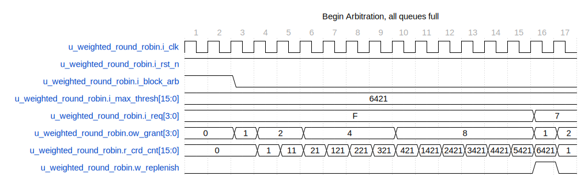
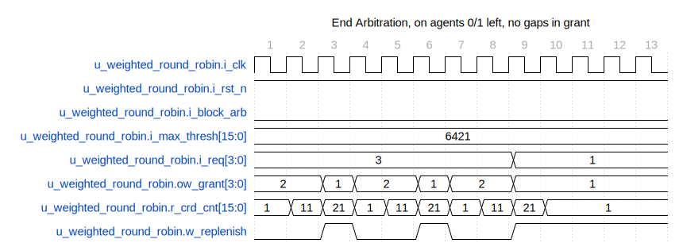
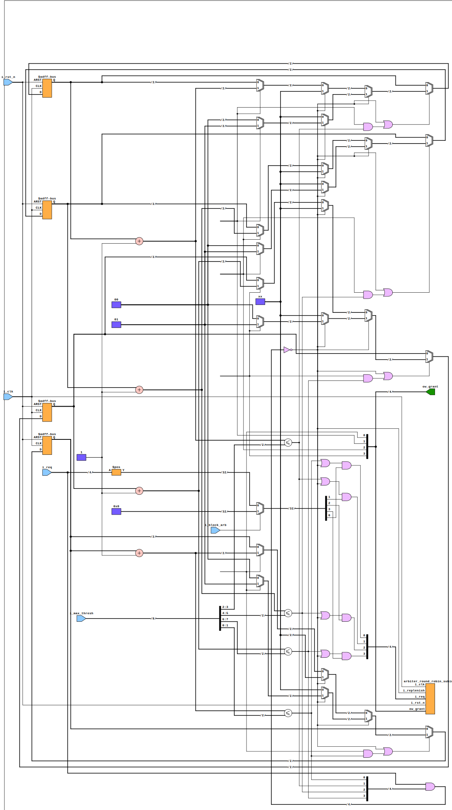

The `arbiter_weighted_round_robin` module is a Verilog implementation of a weighted round-robin arbiter for managing access requests from multiple clients. It assigns access to clients based on a maximum threshold that determines the amount of service each client receives. This arbiter is helpful in situations where different clients need to be serviced fairly but with different priority levels.

## Code Documentation

```verilog

`timescale 1ns / 1ps

module arbiter_weighted_round_robin #(

parameter int MAX_THRESH = 8,

parameter int CLIENTS = 8

) (

input logic i_clk,

input logic i_rst_n,

input logic [(CLIENTS*MAX_THRESH_WIDTH)-1:0] i_max_thresh, // Rather than having many ports for the threshold, there is one that is many bits wide.

input logic [CLIENTS-1:0] i_req,

input logic i_block_arb, // This is a feature I like to add to my arbiters; it backs up the system, then when it is unblocked, one can get very complex, but deterministic behavior. This enables one to hit very hard bugs deep in the system.

output logic [CLIENTS-1:0] ow_grant

);

```

This module has the following parameters and ports:

- **Parameters:**

- `MAX_THRESH`: The maximum threshold weight for any client.

- `CLIENTS`: The number of clients for arbitration.

- **Input Ports:**

- `i_clk`: The system clock.

- `i_rst_n`: The active-low reset signal.

- `i_max_thresh`: Array of maximum thresholds for each client. Its width is `CLIENTS` \* log2 of `MAX_THRESH`.

- `i_req`: A signal where each bit corresponds to a client's request.

- `i_block_arb`: Input to block the arbiter from making new grants (e.g., during special operations).

- **Output Ports:**

- `ow_grant`: Grants output for each client. Each bit corresponds to a grant for the associated client.

The internal logic includes counters for managing each client's credits, functions determining when to replenish credits, and mask requests based on available credits. The module uses a generate statement to create logic for each client.

### Implementation Details

The arbiter tracks each client's credit counters (`r_crd_cnt`). Credit counters increase as the associated client receives service, and when a client has no remaining credits, it cannot receive access until its credit is replenished.

The credit replenishment (`w_replenish`) occurs when no asserted requests have credits left. A round-robin sub-instance (`u_rrb_arb`) makes grant decisions based on masked requests (`w_mask_req`) reflecting the current credit status.

## Waveforms



All requests are pegged high in this start portion of the weighted round-robin. The signal r_crd_cnt adds one to each agent's count as granted. The grant will remain asserted while the request is active and the agent has credits available. In cycle 16, the credits for all agents are consumed, so replenish asserts.



In this waveform, only agents zero and one assert a request. These agents have very few credit counts (1 and 2, respectively.) Notice the replenish signal toggles more frequently.

## Diagram, assuming four clients



### Additional Information

The module includes an initial block to handle waveform dumping for simulation purposes with tools that support `\$dumpfile` and `\$dumpvars`.

### Usage Notes

- Instantiate with specific `MAX_THRESH` and `CLIENTS` values as required for your design.

- Connect clients' request lines (`i_req`) to the arbiter.

- Connect `ow_grant` to the elements controlled based on the arbiter's decision.

- The arbiter operates synchronously with the clock signal `i_clk`.

### Simulation and Debugging

In the given code, signals for debugging and simulation (`synopsys translate_off`, `\$dumpfile`, `\$dumpvars`, `synopsys translate_on`) are intended to be used with simulation tools.

### Conclusion

The weighted round-robin arbiter presented here is a flexible solution for managing competing resource requests. It can be customized to fit various use cases and ensures fair distribution of access based on pre-defined weights.

---

## Block Hierarchy and Links

- [Weighted Round Robin](arbiter_weighted_round_robin)
- [Arbiter Sub Instance](arbiter_round_robin_subinst)
- [Arbiter Fixed Priority](arbiter_fixed_priority)

---

[Return to Index](/docs/mark_down/rtl/)

---
