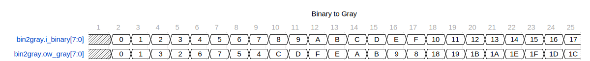

The `bin2gray` module is a Verilog implementation of a binary to Gray code converter. Gray code, or reflected binary code, is a binary numeral system where two successive values differ in only one bit. This property can be helpful for error correction in digital communications and minimizing changes in state in physical hardware implementations that can reduce electronic noise or mechanical wear.

## Source File

**Path:** rtl/common/bin2gray.sv

## Parameters

- `WIDTH`: An integer parameter that defines the number of bits for the binary and Gray code words. It defaults to 4 but can be overridden when instantiating the module.

## Ports

- `input wire [WIDTH-1:0] binary`: This input port accepts a binary word with the number of bits specified by the `WIDTH` parameter.

- `output wire [WIDTH-1:0] gray`: This output port outputs the calculated Gray code equivalent of the binary input.

## Functionality

- Inside a `generate` block, a `for` loop iterates through the bits of the input binary word, performing an XOR operation between adjacent bits (binary[i] XOR binary[i+1]).

- Each result of the XOR operation determines the respective bit in the Gray code output (gray[i]), except the most significant bit (MSB).

- The MSB of the Gray code (gray[WIDTH-1]) is directly assigned the value of the MSB of the binary input.

### Waveform

If one looks carefully at the ow_gray values, one sees only one bit in the entire vector changing with each binary transition. This feature helps to minimize metastability when doing clock crossings.

## Usage

Instantiate this module in your Verilog design and provide the `WIDTH` parameter to match your requirement if you need a different width than the default. Connect the `binary` input to the signal you wish to convert and connect the `gray` output to where you need the resulting Gray code.

---

[Return to Index](/docs/mark_down/rtl/)

---
