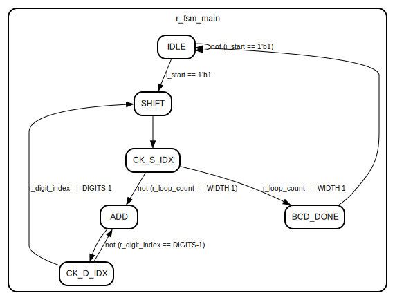
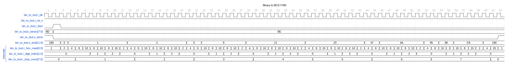

The `bin_to_bcd` module converts a binary number to its Binary-Coded Decimal (BCD) equivalent. It uses a finite state machine (FSM) to manage the conversion process over multiple clock cycles.

## Block

`rtl/common/bin_to_bcd.sv`

This SystemVerilog source file is at `rtl/common/bin_to_bcd.sv`.

### Parameters

- `WIDTH` (Default: 8): The width of the input binary number.

- `DIGITS` (Default: 3): The number of BCD digits in the output.

### Ports

- `i_clk`: The clock input signal.

- `i_rst_n`: The active-low asynchronous reset signal.

- `i_start`: A signal to start the conversion process.

- `i_binary`: The input binary number to convert with width defined by `WIDTH`.

- `o_bcd`: The output BCD number with a width of `DIGITS`×4.

### FSM States

- `S_IDLE`: The idle state, waiting for the start signal.

- `S_SHIFT`: A state to shift the binary number and BCD digits.

- `S_CHECK_SHIFT_INDEX`: State to check for bit shift completion.

- `S_ADD`: State to add 3 to BCD digits if necessary.

- `S_CHECK_DIGIT_INDEX`: State to check if BCD digit processing is complete.

- `S_BCD_DONE`: Final state, indicating BCD conversion completion.

#### FSM Diagram



### Internal Logic

- Maintains the current and next FSM state.

- Shifts and handles the binary input number to create the BCD output.

- Checks individual BCD digits and adds 3 to each digit > 4.

- Signals `o_done` when conversion completes.

### Waveform



Unfortunately, the FSM is not enumerated. We can see it moving through multiple states as it builds up the final BCD encoded number and asserts done at the end.

### Usage

When using the `bin_to_bcd` module, an instance can be created and provided with the binary number to convert. The `i_start` signal initiates the conversion process. Once the conversion finishes, the output appears on `o_bcd`, and the completion of the conversion and the `o_done` signal asserts.

This conversion mechanism allows you to convert binary numbers to their human-readable BCD counterparts, often helpful in displaying the number on hardware like seven-segment displays. Remember to handle reset (i_rst_n) to avoid undefined behavior correctly.

### Example Instantiation

```verilog

bin_to_bcd #(

.WIDTH(8),

.DIGITS(2)

) converter (

.i_clk(clk),

.i_rst_n(rst_n),

.i_start(start_conversion),

.i_binary(binary_input),

.o_bcd(bcd_output),

.o_done(conversion_done)

);

```

This example assumes that there are signals in the environment (`clk`, `rst_n`, `start_conversion`, `binary_input`) for controlling the bin_to_bcd block's operation.

Note: ensure proper synchronization when interfacing with this module, especially regarding the `i_start` signal, the input binary data, and the handling of the `o_done` signal. Additionally, `i_rst_n` should assert to ensure the FSM starts in the `S_IDLE` state upon power-up or whenever a reset is required.

Remember to instantiate this module with a suitable clock rate so that the conversion process completes within the required time frame for the given application.

---

[Return to Index](/docs/mark_down/rtl/)

---
