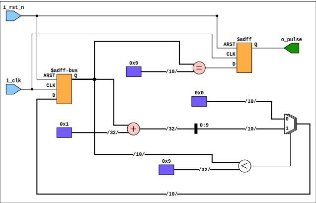
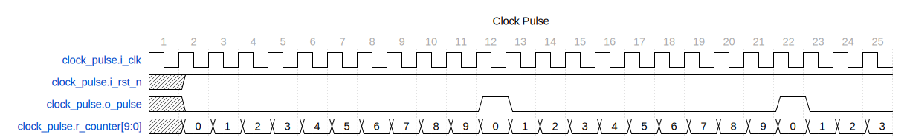

This Verilog module generates a periodic pulse waveform with a width defined by the WIDTH parameter. When the counter reaches the 'WIDTH' value, the pulse is active for one `i_clk` clock cycle.

## Parameters

- `WIDTH`: An integer parameter that defines the pulse width in clock cycles. The default value is 10.

## Ports

- `input logic i_clk`: The input clock signal.

- `input logic i_rst_n`: The active-low asynchronous reset input. When driven low, it resets the internal counter to zero.

- `output logic ow_pulse`: The output pulse signal. Upon meeting the pulse condition, the ow_pulse signal is high for a single `i_clk` period.

## Internal Signals

- `logic [WIDTH-1:0] r_counter`: An internal counter that tracks the number of clock cycles elapsed. It has a range from 0 to `WIDTH-1`.

## Block Diagram

## Waveform

In this waveform, the pulse occurs every ten clocks. The pulse signal comes directly from a flop for maximal stability.

## Functionality

1. The counter is asynchronously reset to 0 when the `i_rst_n` signal is low, indicating a reset condition.

2. On every rising edge of the input clock `i_clk`, the counter increments if the counter is less than `WIDTH`. Once it equals `WIDTH - 1`, it will reset to 0 in the next clock cycle.

3. The output `ow_pulse` is asserted (driven high) for one clock period when the counter equals `WIDTH - 1`.

**Note**: There seems to be a typo in the code snippet provided. The line `assign ow_pulse = (counter == WIDTH - 1);` should probably be `assign ow_pulse = (r_counter == WIDTH - 1);`, matching the internal signal `r_counter`.

## Usage

This module could be instantiated in a larger design to provide precise timing pulses. Users may modify the `WIDTH` parameter at instantiation time to adjust the pulse width to their specific requirements.

---

[Return to Index](/docs/mark_down/rtl/)

---
