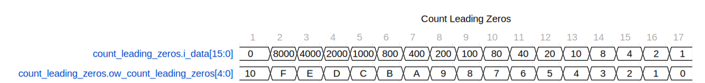

This code defines a Verilog module named `count_leading_zeros` that calculates the number of leading zeros in a binary number. The code is at the path `rtl/common/count_leading_zeros.sv`.

## Features

- Module Name: `count_leading_zeros`

- File path: `rtl/common/count_leading_zeros.sv`

- Parameter `WIDTH`: Sets the width of the input data bus. The default is 32 bits.

- Output `ow_leading_zeros_count`: A register containing the number of leading zeros in the input data.

- The module uses recursion by invoking itself for each half of the input data until the base case is met (when WIDTH is 2).

- The `generate` block creates the recursive structure, allowing different instantiations based on `WIDTH`.

- A function is used to count the zeros starting from bit 0.

## Inputs/Outputs

- **Input** `i_data [WIDTH-1:0]`: Binary input data of width `WIDTH` on which the leading zero count operation is performed.

- **Output** `ow_leading_zeros_count [DoutWidth-1:0]`: The count of leading zeros in the input data, represented in (log2(WIDTH) + 1) bits to cover the maximum possible count.

## Waveform

The waveform shows all cases of a walking one, starting with zero ones. The one walks from bit 15 to bit 0.

## Internal Functionality

- A recursive implementation was attempted, but I could never get it to work.

- A function is used in other places (like find_first_set) so, I followed that implementation.

---

[Return to Index](/docs/mark_down/rtl/)

---
