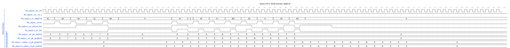
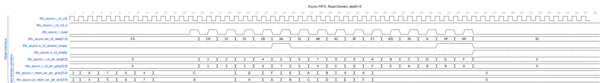

The `fifo_async` module implements a parameterized asynchronous FIFO (First-In, First-Out) buffer with the power of two depths. This means that the depth (`DEPTH`) should be chosen as a power of two for proper operation. The FIFO can handle different clock domains for read and write operations. It is suitable for cases where data is produced and consumed at different rates or on different clock domains.

## Module Parameters

- `DATA_WIDTH`: (int) Width of the data bus.

- `DEPTH`: (int) Depth of the FIFO must be a power of two.

- `N_FLOP_CROSS`: (int) Number of flops for domain crossing, typically two for better metastability handling, although one may see three or four being used.

- `ALMOST_WR_MARGIN`: (int) Margin for the almost full threshold.

- `ALMOST_RD_MARGIN`: (int) Margin for the almost empty threshold.

- `INSTANCE_NAME`: (string) An identifier for the FIFO instance, useful for debugging purposes.

## Ports

### Clocks and Resets

- `i_wr_clk`: (input, logic) Write clock signal.

- `i_wr_rst_n`: (input, logic) Active-low reset signal for write domain.

- `i_rd_clk`: (input, logic) Read clock signal.

- `i_rd_rst_n`: (input, logic) Active-low reset signal for read domain.

### Write Domain

- `i_write`: (input, logic) Write enable signal.

- `i_wr_data`: (input, logic) Data input for the write operation.

- `o_wr_full`: (output, logic) Indicates when the FIFO is full.

- `o_wr_almost_full`: (output, logic) Indicates when the FIFO is almost full.

### Read Domain

- `i_read`: (input, logic) Read enable signal.

- `ow_rd_data`: (output, logic) Data output for the read operation.

- `o_rd_empty`: (output, logic) Indicates when the FIFO is empty.

- `o_rd_almost_empty`: (output, logic) Indicates when the FIFO is almost empty.

## Internal Functionality

- Counts for read and write pointers are maintained in binary and gray codes to avoid glitches during conversions in different clock domains.

- The FIFO memory is implemented using an unpacked array of logic vectors.

- Uses clock domain crossing modules to transfer pointer values between write and read domains safely.

- Generates full and empty signals based on the converted read and write pointers.

- Implements almost full and empty logic that uses a margin to indicate these states before the FIFO is full or empty.

- Error checking in simulation to alert when write operations are attempted on a full FIFO or read operations on an empty FIFO.

- The initial block for dumping waveforms during simulation for debugging purposes.

## Simulation Overview

The write domain and the read domain are broken up into separate waveforms since their clock domains are different.

In cycle 23 the fifo is full. As it gets drained more items are added to it. The critical item to mention is the pointers. There are two sets binary and gray. The gray pointers only have one bit changing each clock to minimize the likeliness of metastability when the pointer goes through a clock crossing.

On the read side, we see the binary pointer starts at 0x0 and wraps back around to 0x0. Through these increments, the gray pointer increments also, but in such a way that only one-bit changes at a time.
The gray pointers for the write and read domain each pass through glitch-free synchronized flops, they are converted to binary on the other side and used for comparisons.

## Simulation Notes

- The module includes test code disabled during synthesis (`synopsys translate_off` / `synopsys translate_on`). This includes error displays and VCD dumping, which can only be used to debug the FIFO's behavior in a simulated environment.

### Usage Considerations

- The `fifo_async` module must operate in a system with proper reset synchronization to ensure a safe and reliable reset of both write and read domains.

- Write and read operations should respect the full and empty status of the FIFO to avoid data corruption or undefined behavior.

---

## Block Hierarchy and Links

- [Fifo async](fifo_async)
- [Fifo full/empty control](fifo_control)
- [Glitch free N-flop](glitch_free_n_dff_arn)
- [Gray to Binary](gray2bin)
- [Combined Binary and gray Counter](counter_bingray)

---

[Return to Index](/docs/mark_down/rtl/)

---
