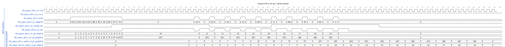
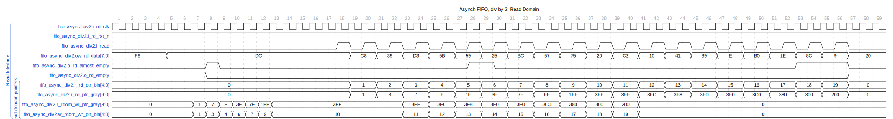

This module implements an asynchronous FIFO (First-In-First-Out) memory structure that operates on separate read and write clock domains, making it suitable for cross-clock-domain data transfers. It has been parametrized to work with any even depth and provides full, almost full, empty, and almost empty flags. Note: it does not use the traditional Gray counter for the crossing. It uses a Johnson counter, which is also a “unit-distance” code.

## Inputs and Outputs

- **Clocks and Reset:**

- `i_wr_clk` (input): Write domain clock

- `i_wr_rst_n` (input): Active-low reset for the write clock domain

- `i_rd_clk` (input): Read domain clock

- `i_rd_rst_n` (input): Active-low reset for the read clock domain

- **Write Domain:**

- `i_write` (input): Write enable signal

- `i_wr_data` (input): Data input for write operations, with the width defined by `DATA_WIDTH`

- `o_wr_full` (output): Indicates when FIFO is full, preventing further write operations

- `o_wr_almost_full` (output): Flags when FIFO is almost full

- **Read Domain:**

- `i_read` (input): Read enable signal

- `ow_rd_data` (output): Data output for read operations, with the width matching `DATA_WIDTH`

- `o_rd_empty` (output): Flags when FIFO is empty, preventing further read operations

- `o_rd_almost_empty` (output): Indicates when FIFO is almost empty

## Parameters

- `DATA_WIDTH` (default: 8): The width of the data bus for each FIFO entry

- `DEPTH` (default: 10): The depth of the FIFO in number of entries

- `N_FLOP_CROSS` (default: 2): Number of DFF stages for the crossing logic

- `ALMOST_WR_MARGIN` (default: 1): The margin for the almost full indication

- `ALMOST_RD_MARGIN` (default: 1): The margin for the almost empty indication

- `INSTANCE_NAME` (default: "DEADF1F0"): Instance name for debugging purposes, to be used in error messages

## Internal Functionality

- Utilizes a binary counter for write and read pointers in each domain.

- Implements Johnson counters for the unit-distance pointers to ensure safe clock domain crossing.

- Crosses pointers between domains using a glitch-free network.

- Converts Johnson pointers to binary for internal operations.

- Memory addresses and status signals are derived from the binary pointers.

- Includes logic to flag the FIFO as full, almost full, empty, and almost empty based on the pointers' status.

- Stores data in a synchronous memory array, sized according to `DEPTH`.

## Simulation Overview

The write domain and the read domain are broken up into separate waveforms since their clock domains are different.

In cycle 15 the fifo is full. As it gets drained more items are added to it. The critical item to mention is the pointers. There are two sets binary and gray. The gray pointers only have one bit changing each clock to minimize the likeliness of metastability when the pointer goes through a clock crossing. Note: these are not the traditional Gray pointers. These use a Johnson counter; a one gets shifted into the lower bit until the whole pointer is ones, then a zero gets loaded into the lowest bit until it is all zeroes again.

On the read side, we see the binary pointer starts at 0x0 and wraps back around to 0x0. Through these increments, the gray pointer increments also, but in such a way that only one bit changes at a time.
The gray pointers for the write and read domain each pass through glitch-free synchronized flops, they are converted to binary on the other side and used for comparisons.

## Clock Domain Crossing

The module safely transfers the fill level indicators across clock domains by using Johnson counter encoding and glitch-free DFF chains. An additional binary encoding is used internally.

## Error Checking

- For debugging, sanity checks ensure that writes are not performed when the FIFO is full, and reads are not performed when the FIFO is empty. Debugging messages will be displayed using `\$display` if errors occur.

- Verilog simulation artifacts for dumping state are also included for debugging (`\$dumpfile` and `\$dumpvars`).

---

## Block Hierarchy and Links

- [Fifo async div by 2](fifo_async_div2)
- [Fifo full/empty control](fifo_control)
- [Glitch free N-flop](glitch_free_n_dff_arn)
- [Johnson to Binary](grayj2bin)
- [Johnson Counter](counter_johnson)
- [Binary Counter](counter_bin)
- [Find the leading one and the trailing one](leading_one_trailing_one)
- [Find the first set](find_last_set)
- [Find the last set](find_first_set)

---

[Return to Index](/docs/mark_down/rtl/)

---
