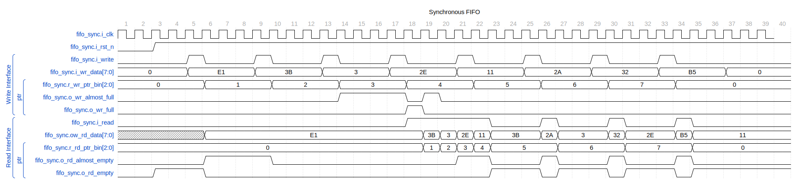

The `fifo_sync` module is a parameterized synchronous FIFO (First-In, First-Out) with configurable data width and depth. It also incorporates "almost full" and "almost empty" indicators.

## Parameters

- **DATA_WIDTH**: The width of the data in bits. The default is 4.

- **DEPTH**: The depth of the FIFO, representing how many elements it can store. The default is 4.

- **ALMOST_WR_MARGIN**: Margin to indicate almost full status. The default is 1.

- **ALMOST_RD_MARGIN**: Margin to indicate almost empty status. The default is 1.

- **INSTANCE_NAME**: Name for this particular FIFO instance used for error reporting. The default is "DEADF1F0".

## Ports

- **i_clk**: Clock input for the FIFO.

- **i_rst_n**: Active low reset signal.

- **i_write**: Write enable signal. When high, data can be written to the FIFO.

- **i_wr_data**: Data input to write to the FIFO.

- **o_wr_full**: Output signal indicating if the FIFO is full.

- **o_wr_almost_full**: Output signal indicating if the FIFO is almost full.

- **i_read**: Read enable signal. When high, data can be read from the FIFO.

- **ow_rd_data**: Data output from the FIFO.

- **o_rd_empty**: Output signal indicating if the FIFO is empty.

- **o_rd_almost_empty**: Output signal indicating if the FIFO is almost empty.

## Internal Design

The FIFO uses an internal memory array to store data and Binary Counters for tracking read and write positions. Binary counters use the parameters provided to size the counters correctly for the depth of the FIFO.

## Behavior

The FIFO stores data when `i_write` is asserted and `ow_wr_full` is not signaled. Data is read when `i_read` is asserted and `ow_rd_empty` is not indicated. "Almost full" and "almost empty" signals provide a margin-based indication for near-full or near-empty conditions suitable for flow control.

### Simulation Overview

This is a simple 4-deep fifo. In cycle 18, we see it going full after the fourth write. In cycle 19, reads start happening and the read pointers increment from 0-7. There is an extra bit at the top of the read-and-write pointers to indicate a rollover. In cycle 18 there are back-to-back reads, emptying the fifo. Notice after eight reads and writes, the pointers roll back over to zeros.

## Error Checking

In debug/translational-off blocks, the FIFO reports errors (like write attempts when full or read attempts when empty) along with the instance name for easier debugging. It also includes dumping signals into a `.vcd` file for waveform analysis.

---

## Block Hierarchy and Links

- [Fifo async](fifo_async)
- [Fifo full/empty control](fifo_control)
- [Binary Counter](counter_bingray)

---

[Return to Index](/docs/mark_down/rtl/)

---
