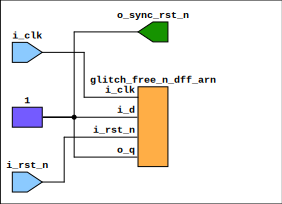

## Overview

The `reset_sync` module is a parameterized reset synchronizer that provides a stable and glitch-free reset signal across different clock domains. It is instrumental in digital circuits where reliable reset synchronization is critical.

## Block Diagram

## Module Description

- **Module Name:** `reset_sync`

### Parameters

- **N_FLOP_CROSS** (Integer): The number of flip-flops used for reset synchronization. A higher number increases the reliability of synchronization at the cost of additional latency.

### Ports

- **i_clk** (Input, Logic): The input clock signal under which the reset needs to be synchronized.
- **i_rst_n** (Input, Logic): The input active-low asynchronous reset signal.
- **o_sync_rst_n** (Output, Logic): The output active-low synchronized reset signal.

## Implementation Details

The `reset_sync` module internally instantiates the `glitch_free_n_dff_arn` module to achieve reset synchronization. This submodule leverages a chain of flip-flops to align the reset signal with the input clock domain, ensuring a stable and glitch-free reset output.

### Clock Crossing Module: `glitch_free_n_dff_arn`

- **FLOP_COUNT**: Corresponds to `N_FLOP_CROSS`. Determines the number of flip-flops used for synchronization.
- **WIDTH**: Set to 1, indicating the synchronization of a single-bit signal.

#### Connections

- **o_q**: Tied to `o_sync_rst_n`. It outputs the synchronized reset signal.
- **i_d**: Constant logic high (`1'1`). Represents the stable state post-reset.
- **i_clk**: Connected to `i_clk`. The clock signal for synchronization.
- **i_rst_n**: Connected to `i_rst_n`. The asynchronous reset signal to be synchronized.

---

[Return to Index](/docs/mark_down/rtl/)

---
