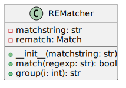

This code defines a `REMatcher` class in Python to simplify using regular expressions by providing an easy-to-use interface for matching strings and retrieving parts of the match. It is helpful as it abstracts the complexity of Python's `re`-module and makes regex operations more akin to how Perl handles them.



The class has two main methods:

- `match()`, which guards against running match operations without having a valid regex pattern by returning a boolean indicator.

- `group()` allows safe retrieval of matching groups with error handling in case of no matches.

**Note**: The `REMatcher` class depends on the `re`-module from Python's standard library.

**File Location**: `project_automation/REMatcher.py`.

**Example Usage**:

```python

m = REMatcher(line)

if m.match(r'.*TESTS=(\d+) PASS=(\d+) FAIL=(\d+) SKIP=(\d+).*'):
    tests_tot = int(m.group(1))
    tests_pass = int(m.group(2))
    tests_fail = int(m.group(3))
    tests_skip = int(m.group(4))

```

---

[Back to Scripts Index](index)

---
