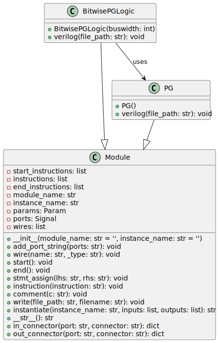

The bitwise_pg_logic block is part of the Python code that creates adders/multipliers.

## Inputs/Outputs

- **Inputs:**

- `i_a[N-1:0]`: Operand A, where N is the bus width.

- `i_b[N-1:0]`: Operand B, where N is the bus width.

- `i_c`: Input carry.

- **Outputs:**

- `ow_g[N:0]`: Output: generate signal

- `ow_p[N:0]`: Output: propagate signals

## Internal Functionality

- The module uses a generate-for loop, which iterates over the bit-width of the operands.
  Within the loop instances of the `math_adder_brent_kung_pg`, the module's purpose is for each bit to calculate, propagate, and generate signals.

- Output propagate and generate signals for bit position 0 handled outside the loop; propagate is set to '0', and generate is set to the input carry.

---

## Block Hierarchy and Links

- [Brent-Kung Adder](brent_kung_adder)
- [Bitwise PG Logic](bitwise_pg_logic)
- [Black](black)
- [Gray](gray)
- [Group PG Logic](group_pg_logic)
- [Sum Logic](sum_logic)

---

[Back to Scripts Index](index)
