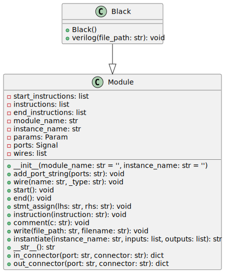

The `Black` class is a Python module at `rtl_generators/adders/brentkung/black.py`. It inherits from the `Module` class in `rtl_generators.verilog.module`. Its purpose is to generate Verilog code for a specific component used in Brent-Kung adder circuits, primarily to compute the generate (`g`) and propagate (`p`) signals at each adder stage.

## Code Documentation

The `Black` class defines a combinatorial logic that typically forms a part of a Brent-Kung parallel-prefix adder, specifically responsible for computing an intermediate generate and propagate signal, which is used in further adder stages for computing the carry signals.

### Inputs/Outputs

The `Black` class specifies the following ports as Verilog inputs/outputs:

- `i_g`: Input logic signal representing the generated value from the current stage.

- `i_p`: Input logic signal representing the propagated value from the current stage.

- `i_g_km1`: Input logic signal representing the generated value from the previous stage (`k-1`).

- `i_p_km1`: Input logic signal representing the propagated value from the previous stage (`k-1`).

- `ow_g`: Output logic signal representing the output generate value (`g = i_g | (i_p & i_g_km1)`).

- `ow_p`: Output logic signal representing the output propagate value (`p = i_p & i_p_km1`).

### Internal Functionality

- `__init__`: The initializer sets the module name to `'math_adder_brent_kung_black'` and adds the defined ports.

- `verilog`: It generates the Verilog code for the block. This process includes:

- Calling the parent class's `start()` method to initiate code generation.

- Using `stmt_assign` to create assignments for `ow_g` and `ow_p`. The `ow_g` output is a logical OR between `i_g` and the logical AND of `i_p` and `i_g_km1`. The `ow_p` output is a logical AND between `i_p` and `i_p_km1`.

- Calling the `end()` method of the parent class to finalize code generation.

- Writing the generated Verilog code to a file with a name based on the module name and a `.sv` file extension in the given `file_path`.

---

## Block Hierarchy and Links

- [Brent-Kung Adder](brent_kung_adder)
- [Bitwise PG Logic](bitwise_pg_logic)
- [Black](black)
- [Gray](gray)
- [Group PG Logic](group_pg_logic)
- [Sum Logic](sum_logic)

---

[Back to Scripts Index](index)

---
