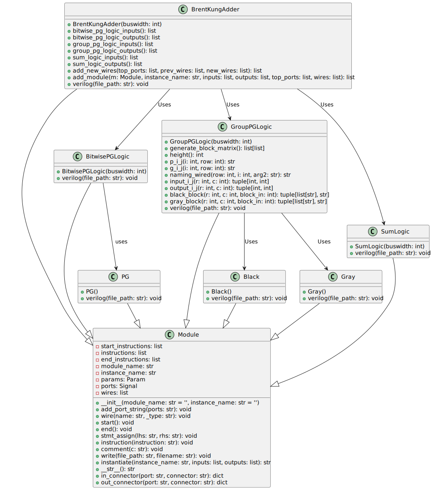

## Description

The `BrentKungAdder` class is a Verilog module generator derived from a base `Module` class, which implements the Brent-Kung parallel-prefix adder architecture. This adder is known for its good logic depth and area efficiency performance, making it suitable for various arithmetic applications. The Python class provided allows for the automatic generation of the Verilog source code for such an adder with a specified bit width.

The class contains methods to define input and output signals, instantiate other required modules (e.g., `BitwisePGLogic`, `GroupPGLogic`, `SumLogic`), interconnect them, and generate the complete Verilog code with the appropriate module instances and connections.

### Inputs

- `i_a[N-1:0]`: First operand of the adder (N bits).

- `i_b[N-1:0]`: Second operand of the adder (N bits).

- `i_c`: Carry-in bit of the adder (single bit).

### Outputs

- `ow_sum[N-1:0]`: Sum output of the adder (N bits).

- `ow_carry`: Carry-out bit of the adder (single bit).

### Parameters

- `Parameter int N=8`: Defines the bit width of the adder. It is a parameterized value, defaulting to 8 bits.

### Internal Modules

This module internally instantiates three other modules:

1. `BitwisePGLogic`: Generates the propagate and generate signals (ow_p and ow_g) for each bit.

2. `GroupPGLogic`: Processes the propagate and generate signals at a group level to facilitate faster addition.

3. `SumLogic`: Computes the final sum and carry out using the `GroupPGLogic` outputs.

### Functionality

1. `__init__(buswidth)`: Initializes the adder module with the given bus width by setting up ports, parameters, and module names.

2. `bitwise_pg_logic_inputs()`: Returns a list of dictionaries describing the inputs to the `BitwisePGLogic` module.

3. `bitwise_pg_logic_outputs()`: Returns a list of dictionaries describing the outputs from the `BitwisePGLogic` module.

4. `group_pg_logic_inputs()`: Returns a list of dictionaries describing the inputs to the `GroupPGLogic` module.

5. `group_pg_logic_outputs()`: Returns a list of dictionaries describing the outputs from the `GroupPGLogic` module.

6. `sum_logic_inputs()`: Returns a list of dictionaries describing the inputs to the `SumLogic` module.

7. `sum_logic_outputs()`: Returns a list of dictionaries describing the outputs from the `SumLogic` module.

8. `add_new_wires(top_ports, prev_wires, new_wires)`: Adds new wires for connecting module instances, ensuring no name collisions.

9. `add_module(m, instance_name, inputs, outputs, top_ports, wires)`: Adds a new module instance with the specified connections and updates wires accordingly.

10. `verilog(file_path)`: Generates the Verilog code for the added module instances and writes it to the specified file path.

### Usage

Instantiate the `BrentKungAdder` class with the desired bus width to create a parallel prefix adder of that size. Then, call the `verilog(file_path)` method to produce the Verilog source code and write it to a file.

---

## Block Hierarchy and Links

- [Brent-Kung Adder](brent_kung_adder)
- [Bitwise PG Logic](bitwise_pg_logic)
- [Black](black)
- [Gray](gray)
- [Group PG Logic](group_pg_logic)
- [Sum Logic](sum_logic)

---

[Back to Scripts Index](index)

---
