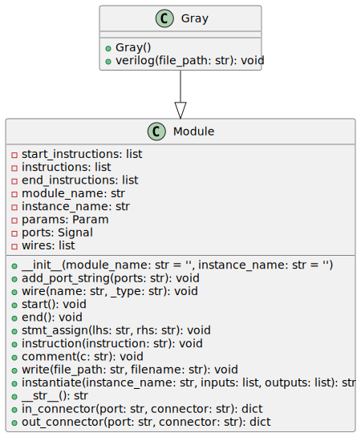

The `Gray` class is a Python class intended for generating a SystemVerilog module for a portion of a Brent-Kung adder, specifically a Gray cell, which performs fast binary addition. The class inherits from a Module-based class, part of a more extensive library of RTL generator tools.

## Inputs / Outputs

- **i_g**: Input logic signal representing the generated signal for the current bit.

- **i_p**: Input logic signal representing the propagate signal for the current bit.

- **i_g_km1**: Input logic signal representing the generated signal for the previous bit (bit k minus 1).

- **ow_g**: Output logic signal representing the output generate signal post-computation.

## Internal Functionality

### Initialization (`__init__`)

Upon initialization, the `Gray` class calls the constructor of the `Module` base class with `module_name` set to the value of `module_str`, which is `'math_adder_brent_kung_gray'`. Additionally, the ports for the module are defined in `port_str` and added to the module by calling the `add_port_string` method inherited from the `Module` base class.

### Verilog Code Generation (`verilog`)

The `verilog` method generates the SystemVerilog code for the Gray cell.

- **Start**: Invokes the `start` method of the `Module` class to prepare for writing the SystemVerilog code.

- **Assignments**: The logic for the Gray cell implements a single assignment statement connecting the inputs to the output `ow_g`. The Boolean expression `i_g | ( i_p & i_g_km1 )` represents the logic equation for the Gray cell operation within the Brent-Kung adder, used to calculate the carry-out signal.

- **End**: Invokes the `end` method of the `Module` class to finalize the SystemVerilog code.

- **Write File**: The generated code writes to a file whose path is defined by the `file_path` parameter and whose name is the `module_name` with a `.sv` extension.

---

## Block Hierarchy and Links

- [Brent-Kung Adder](brent_kung_adder)
- [Bitwise PG Logic](bitwise_pg_logic)
- [Black](black)
- [Gray](gray)
- [Group PG Logic](group_pg_logic)
- [Sum Logic](sum_logic)

---

[Back to Scripts Index](index)

---
