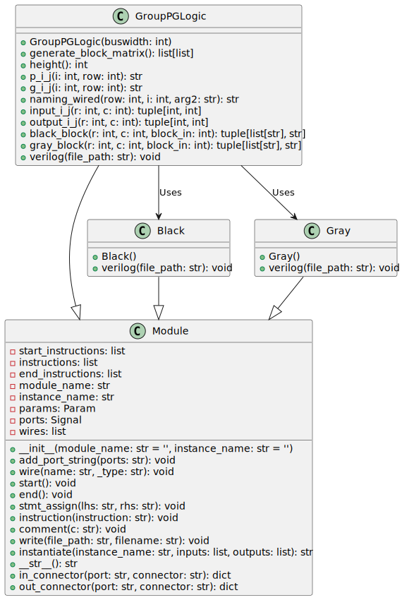

The `group_pg_logic` is a Python module used for generating Verilog code that represents a group propagate-generate logic block, which is a fundamental part of the Brent-Kung adder, a parallel prefix form of carry-lookahead adder used for high-speed arithmetic operations. This code block creates a matrix computation structure to compute carry propagation and generation terms effectively.



```python

import math

from rtl_generators.verilog.module import Module

from .black import Black

from .gray import Gray

def create_matrix_2d(row, col, default_val='x'):
    return [[default_val] * col for _ in range(row)]
```

The above function `create_matrix_2d` is a utility to create a two-dimensional matrix (list of lists) with a specified number of rows and columns, initializing each element with a default value, `'x'` by default.

## Class: GroupPGLogic

`GroupPGLogic` inherits from `Module`, a class likely provided by the `rtl_generators.verilog.module`. `GroupPGLogic` encapsulates the logic and structure needed to generate the Verilog representation of the group propagate-generate logic for the Brent-Kung adder.

### Attributes

- `module_str`: Name of the Verilog module.

- `param_str`: Parameter string defining the bit-width of input and output vectors.

- `port_str`: String defining the input and output ports of the module.

- `buswidth`: The bit-width of the operands for the adder.

- `bitwidth`: The bit-width plus one accommodates the additional bit for carry.

- `block_matrix`: A 2D array representing the binary tree structure used in the adder.

### Methods

- `__init__(self, buswidth)`: Constructor that initializes the module name, ports, parameters, block matrix, and dimensions.

- `generate_block_matrix(self)`: Creates the block matrix used to determine the structure of propagate-generate blocks in the matrix.

- `height(self)`: Computes and returns the height of the block matrix.

- `p_i_j(self, i, row)`: Generates propagate signal naming.

- `g_i_j(self, i, row)`: Generates generate signal naming.

- `input_i_j(self, r, c)`: Computes input signals for a row and column in the block matrix.

- `output_i_j(self, r, c)`: Computes output signals for a row and column in the block matrix.

- `black_block(self, r, c, block_in)`: Defines the logic for instantiating black blocks used in the structure.

- `gray_block(self, r, c, block_in)`: Defines the logic for instantiating gray blocks used in the structure.

- `verilog(self, file_path)`: A primary method that generates the Verilog code for the propagate-generate block and writes it to a file specified by `file_path.`

### Internal Functionality

- The block matrix defines a pattern of black and gray cells corresponding to different logic blocks (Black and Gray classes). These blocks receive input signals and compute intermediate generate and propagate signals that ultimately contribute to the Brent-Kung adder's final sum and carry-out values.

- Propagate (`P`) and generate (`G`) signals are connected accordingly based on the binary tree structure suggested by the block matrix.

- The `verilog` method iterates over the rows and columns of the block matrix, instantiating black and gray blocks, creating the necessary wires and assignments between them, and building up the instructions that will be part of the final Verilog module.

## Block Hierarchy and Links

- [Brent-Kung Adder](brent_kung_adder)
- [Bitwise PG Logic](bitwise_pg_logic)
- [Black](black)
- [Gray](gray)
- [Group PG Logic](group_pg_logic)
- [Sum Logic](sum_logic)

---

[Back to Scripts Index](index)

---
