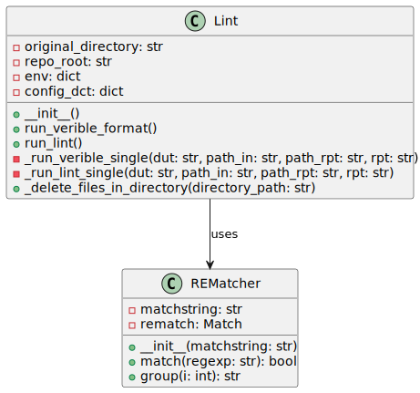

## Overview

The `lint` class in `project_automation/lint.py` performs linting and formatting on RTL (Register Transfer Level) code, specifically Verilog files, using various tools such as Verible and Yosys. The class ensures the code follows specific style guidelines and checks for typical coding mistakes.

## Class: Lint

### Description

The `Lint` class provides methods to run two operations:

- Formatting Verilog files using Verible.

- Linting Verilog files using Verible's linter and Yosys.

The class maintains the directory structure for reports and uses a configuration file to manage the linting process.

### Attributes

- `original_directory (str)`: Stores the current working directory when the class.

- `repo_root (str)`: The absolute path to the repository's root directory.

- `env (dict)`: Environment variables including `REPO_ROOT`.

- `config_dct (dict)`: A dictionary containing configuration parameters read from a JSON file.

### Public Methods

#### `run_verible_format()`

Performs code formatting on Verilog files using Verible formatter, saving logs in a `format_logs` directory. It reads directories to format from a configuration file (`config.json`).

#### `run_lint()`

Run the linting process on Verilog files using Verible lint and Yosys lint tools. It stores the reports in the directories specified in the `config.json` file.

### Private Methods

#### `_run_verible_single(dut: str, path_in: str, path_rpt: str, rpt: str)`

Runs Verible lint on a single file. The parameters are: Design Under Test (DUT) as `dut`, input path as `path_in`, report path as `path_rpt`, and report filename as `rpt`. Outputs go to a specified report file.

#### `_run_lint_single(dut: str, path_in: str, path_rpt: str, rpt: str)`

Performs linting using the Yosys tool on a single file with parameters similar to `_run_verible_single`. Outputs go to a specified report file.

#### `_delete_files_in_directory(directory_path)`

Deletes all files in the specified directory to clear out old reports before generating new ones.

### Command-line Options

No direct command-line options are implemented for the class methods, as they exist within a Python environment. However, `subprocess.run` executes shell commands for external linting and formatting tools.

## Usage

The `Lint` class and its methods exist within a more extensive project automation system from a script that sets up the necessary environment and calls the appropriate methods based on project needs.

---

[Back to Scripts Index](index)

---
