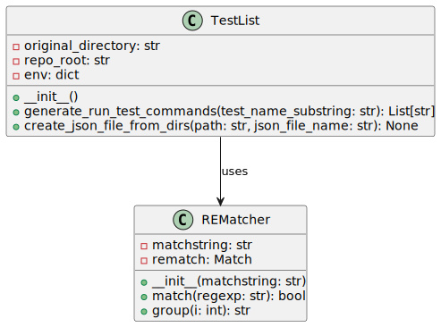

The `list_test` module located at `project_automation/list_test.py` provides functionalities centered around the management and execution of test lists within a given repository. The code assumes a standard directory structure and utilities such as `git` and `make` for interaction with the test environment and files.



## Class `TestList`

This class facilitates the generation of run commands for tests and creating a test list JSON file from directories.

### `__init__(self)`

The constructor of the `TestList` class initializes the instance by saving the current working directory and finding the repository root using the Git VCS. It creates an environment dictionary incorporating the `REPO_ROOT` to support later operations.

#### Attributes

- `original_directory`: A string representing the current working directory at the instance's creation.

- `repo_root`: A string representing the absolute path to the repository's root.

- `env`: A dictionary containing the environment variables with the added `REPO_ROOT` key.

---

### `generate_run_test_commands(self, test_name_substring)`

#### Description, generate_run_test_commands

Generates and prints a list of commands to run tests that include a given substring in their names.

#### Parameters, generate_run_test_commands

- `test_name_substring` (`str`): The substring to search within the names of the tests.

#### Returns, generate_run_test_commands

- `None`: While the method doesn't return the commands, it prints them to the standard output.

#### Internal Functionality, generate_run_test_commands, generate_run_test_commands

1. The method reads a configuration JSON file defining various test list levels.

2. It iterates over each level and reads the corresponding test list JSON file.

3. For each test in the list, the method checks if the `test_name_substring` is part of the test's name.

4. If a test matches, it constructs a command string with the test's name, a default tag (`my_tag`), an optional seed, and any additional parameters specified.

5. It appends the command string to a list of commands and prints them out at the end.

#### Example Usage, generate_run_test_commands

```python

# Initialize the TestList object

test_list_obj = TestList()

# Call the method with the desired substring

test_list_obj.generate_run_test_commands("arbiter")

```

---

### `create_json_file_from_dirs(self, path, json_file_name)`

#### Description, create_json_file_from_dirs

Creates a JSON file that lists tests based on the directories within a specified path. Each test corresponds to a directory and includes test-specific parameters extracted from Makefiles within these directories.

#### Parameters, create_json_file_from_dirs

- `path` (`str`): The filesystem path where the test directory location resides.

- `json_file_name` (`str`): The filename for the generated JSON file containing the test list.

#### Returns, create_json_file_from_dirs

- `None`: The result is a file created in the specified `json_file_name`.

#### Internal Functionality, create_json_file_from_dirs

1. Iterates over all the subdirectories in the specified `path`.

2. For each directory, it constructs a relative path after the repo root and builds a dictionary with the test name.

3. Optionally reads parameters from a `Makefile` within each test directory, looking for compiled arguments and a seed.

4. Appends each test dictionary to a list later sorted and written to the specified JSON file.

#### Example Usage, create_json_file_from_dirs

```python

# Initialize the TestList object

test_list_obj = TestList()

# Create the JSON file from the directories

test_list_obj.create_json_file_from_dirs("/path/to/tests", "test_list.json")

```

---

[Back to Scripts Index](index)

---
