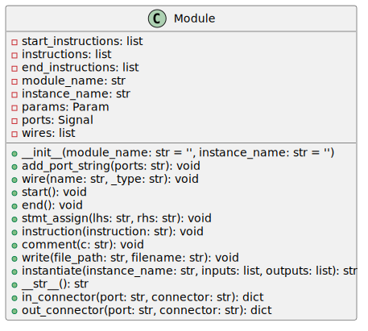

The `module.py` file is a Python class that facilitates the construction of Verilog module templates. It allows users to programmatically define modules with parameters, input and output ports, wires, and other Verilog constructs.



## Class: Module

```python

class Module(object):

def _*init*_(self, module_name='', instance_name=''):

# Initialization of module attributes and collections

```

### Properties

- `module_name`: A string to hold the name of the Verilog module.

- `instance_name`: A string to hold the instance name within the module.

- `params`: An instance of the `Param` class to manage module parameters.

- `ports`: An instance of the `Signal` class to manage module ports.

- `wires`: A list to hold wires and their types.

### Methods

#### `add_port_string(ports: str)`

Adds the string representation of ports to the module.

#### `wire(name, _type)`

Defines a wire within the module.

#### `start()`

Begins the definition of a Verilog module by generating the appropriate timescale and parameter configurations.

#### `end()`

Terminates the Verilog module definition with `endmodule`.

#### `stmt_assign(lhs, rhs)`

Creates an assignment statement in Verilog syntax.

#### `instruction(instruction)`

Appends a raw instruction to the module body.

#### `comment(c)`

Adds a comment line within the module.

#### `write(file_path, filename)`

Writes the module to a Verilog file at `file_path/filename`.

#### `__str__()`

Returns a string representation of the instructions.

#### `instantiate(instance_name, inputs, outputs)`

Generates an instantiation of the defined module with provided inputs and outputs.

#### Static Methods

##### `in_connector(port, connector)`

Creates a dictionary that represents an input connector.

##### `out_connector(port, connector)`

Creates a dictionary that represents an output connector.

## Dependency Files

- `signal.py`: Includes the `Signal` class used to represent Verilog signals such as ports.

- `param.py`: Includes the `Param` class for Verilog parameters.

To generate a Verilog module using the `Module` class, you should first create an instance, configure its parameters, ports, and wires using the provided methods, and then write to a file or instantiate as needed.

```python

# Example Usage

module_instance = Module('my_module')

module_instance.add_port_string('input clk, input rst')

module_instance.wire('internal_sig', 'logic')

module_instance.start()

module_instance.stmt_assign('output_sig', 'internal_sig')

module_instance.end()

module_instance.write('./', 'my_module.v')

```

This example will generate a Verilog file `my_module.v` with a module that includes an input clock, a reset signal, an internal signal, and an output signal assigned from the internal signal.

Remember that this class does not check the syntax or semantic correctness of the generated Verilog code. The user must ensure the constructed module is valid and synthesizable according to Verilog standards.

---

## Block Hierarchy and Links

- [Module Class](module)
- [Parser Helper Class](verilog_parser)
- [Signal Class](signal)
- [Parameter Class](param)
- [Utils](utils)

---

[Back to Scripts Index](index)

---
