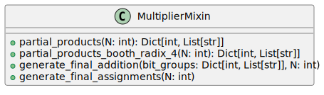

This Python module defines a `MultiplierMixin` class, which contains methods for generating Verilog code for multipliers, including Dadda, Wallace, and Booth radix-4 multipliers. The class is used as a mixin (hence the name), providing standard functionality for more specific multiplier classes that would inherit from this.

## Partial Products Generator for Dadda/Wallace Multiplier

Generates partial products for a Dadda/Wallace multiplier. This method generates partial products for a Dadda multiplier by populating bit groups based on the given buswidth, N.

**Inputs/Outputs:**

- The method `partial_products` takes a single integer parameter `N,` determining the multiplier's input/output buswidth.

- It returns a dictionary `bit_groups` where each key represents a bit position, and the value is a list of generated signal names corresponding to that bit position.

**Internal Functionality:**

- The method generates partial products for each pair of bits in the multiplier and multiplicand.

- It uses `itertools.product` to iterate over all combinations of bit positions.

- Each partial product is formed by ANDing the corresponding bits from the multiplier and multiplicand.

- The signal names for the partial products are formatted and stored in the `bit_groups` dictionary to be accessed later in the multiplier construction process.

---

## Partial Products Generator for Booth Radix-4 Multiplier

**Inputs/Outputs:**

- Like the Dadda/Wallace generator, the Booth Radix-4 method takes an integer `N` for the buswidth and returns a dictionary `bit_groups`.

- In the Booth Radix-4 multiplier, partial product generation is different, using Booth encoding to handle groups of three bits at a time.

**Internal Functionality:**

- The method pads the input to ensure it is divisible by 3 for more straightforward Booth encoding.

- Booth groups are formed and passed through a Booth encoder module to generate encoded values.

- The encoded values are multiplied with the corresponding bits of the multiplicand to form partial products, then added to the `bit_groups`.

---

## Final Addition Stage Generator

**Inputs/Outputs:**

- The method `generate_final_addition` receives a filled `bit_groups` dictionary and a buswidth `N`.

- It uses the information from `bit_groups` to generate the final addition stage of the multiplier.

**Internal Functionality:**

- Full adder instantiation adds the partial product bits and carry bits from previous stages.

- Each bit position from the final addition is wired to the designated sum and carries outputs, ultimately building up the final product output bits.

---

## Final Products Assignment

**Inputs/Outputs:**

- This method does not return a value but generates Verilog `assign` statements that assign the final product bits to the output register.

- It takes the buswidth `N` to know how many bits to assign.

**Internal Functionality:**

- The method iterates over each bit position and assigns it to the corresponding bit of the multiplier's product output, using the sums calculated in the final addition stage.

---

The code does not explicitly show complete class definitions or implementations for the Verilog generation, and it's intended that these methods would be part of a more extensive system that includes these definitions. Each method in the `MultiplierMixin` class assumes a `self.instruction` method responsible for emitting the actual Verilog code lines and a `self.comment` method for inserting comments in the generated Verilog.

## Block Hierarchy and Links

- [Dadda Multiplier](dadda_multiplier)
- [Wallace Multiplier](wallace_multiplier)
- [Multiplier Mixin Logic](multiplier_mixin)

---

[Back to Scripts Index](index)

---
