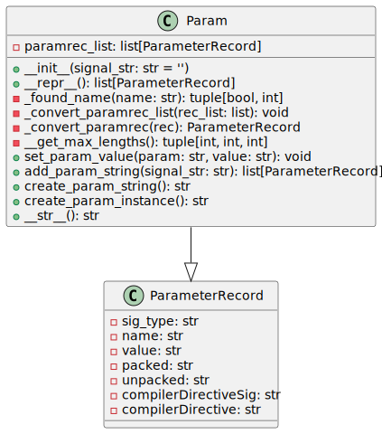

The `param` module at `rtl_generators/verilog/param.py` is a Python script that handles Verilog module parameter records. It defines a `ParameterRecord` data class to store details about parameters such as their type, name, value, packed and unpacked notation, and any associated compiler directives. The `Param` class provides methods for operating on lists of these parameter records, such as parsing, manipulating, and generating Verilog parameter declarations and instance strings.

## Features

- Parses and stores parameter records into an internal list.

- Merges parameter records upon finding the same parameter.

- Sets new values for existing parameters.

- Generates formatted parameter declaration strings.

- Produces parameter instance strings for module instantiations.

## `ParameterRecord` Data Class

- `sig_type`: String indicating the type of signal (e.g., `parameter`, `localparam`).

- `name`: Name of the parameter.

- `value`: Assigned value of the parameter.

- `packed`: Packed dimension(s) of the parameter, if applicable.

- `unpacked`: Unpacked dimension(s) of the parameter, if applicable.

- `compilerDirectiveSig`: Compiler directive signal associated with the parameter.

- `compilerDirective`: Compiler directive for the parameter.

## `Param` Class

### Initialization

The constructor accepts an optional `signal_str` string, which, if provided, will be parsed to populate the internal list of parameter records.

### Public Methods

- `__repr__(self)`: Returns a string representation of the `Param` object.

- `set_param_value(self, param, value)`: Sets a new value for a parameter with the specified name.

- `add_param_string(self, signal_str)`: Parses a string of parameters and adds them to the internal list.

- `create_param_string(self) -> str`: Generates a Verilog-compatible parameter declaration string.

- `create_param_instance(self) -> str`: Produces a comma-separated string for parameter instantiation in module instances.

### Internal Methods

- `_found_name(self, name: str) -> Tuple[bool, int]`: Checks if a parameter with the given name exists in the list.

- `_convert_paramrec_list(self, rec_list)`: Converts a list of parameter records and merges them into the internal list if needed.

- `_convert_paramrec(self, rec) -> ParameterRecord`: Helper function that converts a raw record into a `ParameterRecord` object.

- `__get_max_lengths(self)`: Calculates maximum string lengths for type, packed dimensions, and names of parameters.

## Usage

Instantiate the `Param` class and use its methods to handle Verilog parameter records for a given module. It assists in creating parameter declaration strings for the module and instantiation strings for the parameter assignment upon module instantiation.

## Dependencies

The `param` module depends on the `ParserHelper` class from `rtl_generators.verilog.verilog_parser` for parsing Verilog parameter strings and performing string manipulations.

**Note:** The implementation details, such as method parameters or internal logic, are subject to change based on the current behavior and usage within the application.

---

## Block Hierarchy and Links

- [Module Class](module)
- [Parser Helper Class](verilog_parser)
- [Signal Class](signal)
- [Parameter Class](param)
- [Utils](utils)

---

[Back to Scripts Index](index)

---
