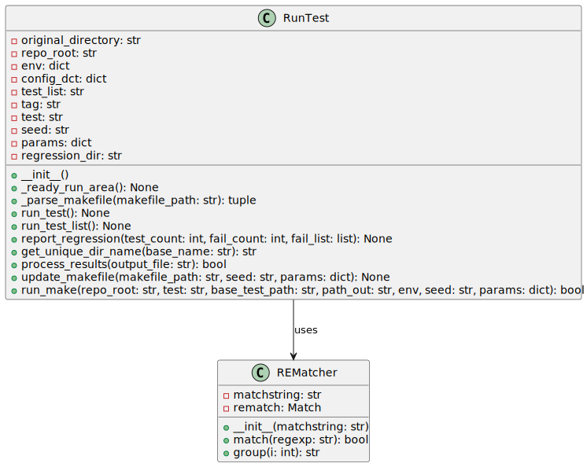

`run_test.py` is a Python script responsible for automating the process of running tests and reporting regression test results in a project. This script is part of the `project_automation` directory and primarily uses regression testing. Below is the detailed documentation of the script.



## RunTest Class

The `RunTest` class encapsulates all the necessary details and methods to run individual tests, a list of tests, and reporting facilities.

### Initialization

`RunTest` requires specific parameters to initialize:

- `test`: The name of the individual test to run.

- `test_list`: The name of the test list file which contains multiple tests. Note: this comes from the config.json file described here: TODO

- `tag`: Tag for the regression test run.

- `seed`: Seed value used during the tests for deterministic behaviors.

- `params`: Custom parameters that may impact the test run. This option is usually only used for one test or a group of tests operating on one set of logic since the parameters may conflict if multiple RTL logic gets tested simultaneously.

- `randomize`: A flag to choose to randomize the seeds on this regression.

- `short_name`: A flag to choose to regression test name that only includes the seed value

Upon initialization, it sets up the testing environment by determining the repository root, copying necessary configuration files, and creating a unique directory for test results.

#### Example of Initialization

```python

instance = RunTest(test="my_test", test_list="test_list", tag="runtest", seed="12345", params={"param1": "value1", "param2": "value2"}, randomize=False)

```

### Methods

#### `_ready_run_area`

Sets up the directory where the regression test will run.

#### `_parse_makefile`

Extracts parameters like `SEED` and `COMPILE_ARGS` from a given Makefile.

#### `run_test`

Executes an individual test, sets the environment, and reports the result.

#### `run_test_list`

Executes a list of tests defined in a JSON file, then aggregates and reports results.

#### `report_regression`

Generates and prints a report summarizing the test run, including the number of tests run, passed, and failed.

#### `get_unique_dir_name`

Generates a unique directory name to avoid conflicts with existing directories.

#### `process_results`

Process output files to determine if the tests passed.

#### `update_makefile`

Updates the makefile based on the provided seed and parameters before running a test.

#### `run_make`

Executes a make command to run the test based on the provided environment and parameters.

## How to Use

Run the module as a script with the necessary command line options. Depending on the provided arguments, it can execute a single test or a list of tests.

## Required External Files

- `config.json`: Contains project-wide configuration options.

- Test list JSON file: Defines which tests to run and their parameters if running a list of tests.

---

[Back to Scripts Index](index)

---
