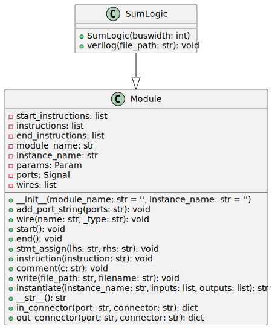

The `sum_logic` module is part of a collection of Python scripts to generate Verilog code for various hardware designs. Specifically, this Python module generates the sum logic component of a Brent-Kung adder, a type of parallel prefix adder known for its logarithmic depth in terms of logic gates.

## Python Code Documentation

The Python code provided below executes to create a hardware description of the sum logic in SystemVerilog. The script is part of the repository at `RTL_Design_Projects/tools/rtl_generators/`.

### Dependencies

The script requires the `verilog` module, more precisely `Module` class, from the file `verilog_parser.py` located in the `base_path` directory.

### Inputs/Outputs

#### Inputs

- **i_p**: Carry propagate signal, `logic` array with `N+1` bits (`N:0`).

- **i_gg**: Carry generate signal, `logic` array with `N+1` bits (`N:0`).

#### Outputs

- **ow_sum**: The sum output, a `logic` array with `N` bits (`N-1:0`).

- **ow_carry**: The carry output, a single `logic` bit.

### Internal Functionality

The `SumLogic` class inherits from the `Module` class and generates the SystemVerilog representation of the sum logic component. The `buswidth` parameter passed during initialization defines the bitwidth of the input and output ports.

The `verilog()` method takes a `file_path` as its argument and writes the generated Verilog code to the specified location as a `.sv` file. The code includes:

- A `generate` loop using a genvar `k` to produce an XOR operation between the carry generate signal `i_gg` and the carry propagate signal `i_p` bit by bit, making the `ow_sum` signal.

- Assignment of the highest bit of the carry generates signal `i_gg` to produce the `ow_carry` signal.

---

## Block Hierarchy and Links

- [Brent-Kung Adder](brent_kung_adder)
- [Bitwise PG Logic](bitwise_pg_logic)
- [Black](black)
- [Gray](gray)
- [Group PG Logic](group_pg_logic)
- [Sum Logic](sum_logic)

---

[Back to Scripts Index](index)

---
