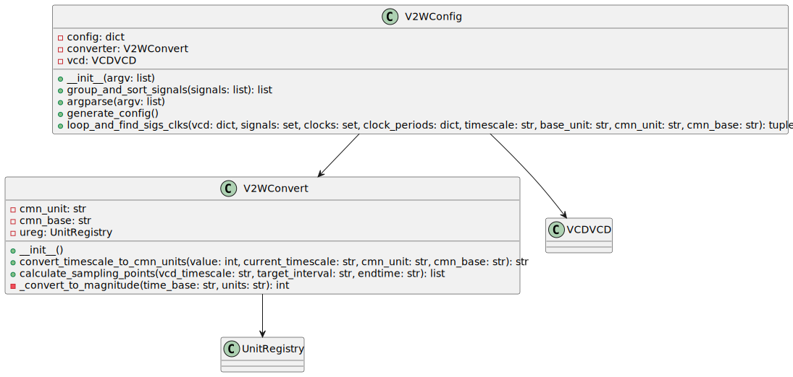

## Overview

The `V2WConfig` class configures and processes VCD (Value Change Dump) files into the WaveDrom format. It includes methods for parsing command-line arguments, grouping and sorting signals, generating configuration files, and identifying clocks within the VCD data.

## Methods

### `__init__(argv: list)`

The constructor initializes the `V2WConfig` instance. It sets up the configuration dictionary, a `V2WConvert` object, and initializes the VCD data. It then parses the provided command-line arguments.

### `group_and_sort_signals(signals: list) -> list`

Groups and sorts the given list of signals based on a hierarchy list defined in the configuration. It returns the sorted and grouped list of signals.

### `argparse(argv: list)`

Parses the command-line arguments provided to the script. It sets up configuration parameters like input and output files, sampling rate, start and end times, etc.

### `generate_config()`

Generates a configuration file based on the VCD file. It identifies signals, clocks, and their periods and writes this information to a specified configuration file.

### `loop_and_find_sigs_clks(vcd: dict, signals: set, clocks: set, clock_periods: dict, timescale: str, base_unit: str, cmn_unit: str, cmn_base: str) -> tuple`

Loops through the VCD data to extract signals, identify clocks, and determine the maximum time value found in the VCD data and the fastest clock period. It returns a tuple containing these values.

## Dependencies

- `V2WConvert`: Used for converting VCD data to WaveDrom format.
- `VCDVCD`: Used for handling VCD file data.

---

## Block Hierarchy and Links

- [VCD to Wavedrom 2](vcd2wavedrom2)
- [V2W Converter](v2wconvert)
- [V2W Config](v2wconfig)

---

[Back to Scripts Index](index)

---
