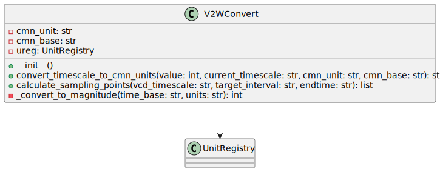

## Overview

`V2WConvert` is a class designed to facilitate converting time units and calculating sampling points for VCD (Value Change Dump) file analysis. It utilizes the Pint library for unit conversion.

## Properties

- `cmn_unit`: A string representing the unit for human-readable items (in this case, 1ns)
- `cmn_base`: A string representing the base unit for conversions (in this case, ns)
- `ureg`: An instance of `UnitRegistry` from Pint for unit conversion.

## Methods

### `__init__(self)`

Constructor method that initializes the `V2WConvert` instance. It creates a new `UnitRegistry` object for handling unit conversions.

### `convert_timescale_to_cmn_units(self, value, current_timescale, cmn_unit, cmn_base) -> str`

Converts a given value from one timescale to another, specified in standard units. It returns the converted value as a string formatted with the new base unit.

- `value`: The numerical value for conversion.
- `current_timescale`: The current timescale unit of the value (e.g., 'ns', 'us').
- `cmn_unit`: The unit for the new timescale (e.g., 'ps', 'ns').
- `cmn_base`: The base unit for the new timescale (e.g., 's', 'ms').

### `calculate_sampling_points(self, vcd_timescale, target_interval, endtime) -> list`

The sampling points for a VCD file are calculated based on the provided timescale, target interval, and end time. It returns a list of sampling points represented as integers.

- `vcd_timescale`: The timescale of the VCD file (e.g., '1ns').
- `target_interval`: The desired interval between sampling points (e.g., '100ps').
- `endtime`: The end time up to which sampling points are calculated (e.g., '1us').

### `_convert_to_magnitude(self, time_base, units) -> int`

A private method that converts a given time base to its magnitude in the specified units.

- `time_base`: The time base to convert (e.g., '1ns').
- `units`: The units to convert the time base into (e.g., 's').

## Dependencies

- `pint`: A library used for handling unit conversions.

---

## Block Hierarchy and Links

- [VCD to Wavedrom 2](vcd2wavedrom2)
- [V2W Converter](v2wconvert)
- [V2W Config](v2wconfig)

---

[Back to Scripts Index](index)

---
