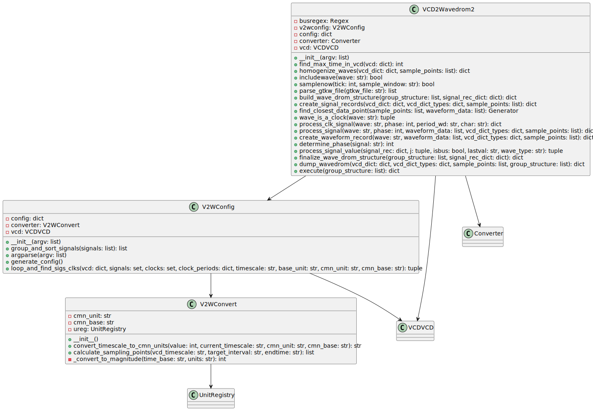

## Overview

`VCD2Wavedrom2` is a class designed for converting Value Change Dump (VCD) data into WaveDrom format. It provides methods for processing and generating WaveDrom JSON based on VCD data, handling configuration and command-line arguments.

## Methods

### `__init__(self, argv)`

Constructor that initializes the `VCD2Wavedrom2` instance with command-line arguments. It sets up configuration and VCD processing utilities.

### `find_max_time_in_vcd(self, vcd)`

Finds the maximum time value in the provided VCD data.

### `homogenize_waves(self, vcd_dict, sample_points)`

Homogenizes waveforms by adding missing samples and adjusting the timescale.

### `includewave(self, wave)`

Determines whether to include a waveform signal based on configuration settings.

### `samplenow(self, tick, sample_window)`

Decide when to take a sample based on configuration.

### `parse_gtkw_file(self, gtkw_file)`

Parses a GTKWave save file to determine the structure of groups and signals.

### `build_wave_drom_structure(self, group_structure, signal_rec_dict)`

Builds the WaveDrom JSON structure based on groups and signal records.

### `create_signal_records(self, vcd_dict, vcd_dict_types, sample_points)`

Creates waveform records for signals in the VCD dictionary.

### `find_closest_data_point(self, sample_points, waveform_data)`

Finds the closest data point for each sample point in the waveform data.

### `wave_is_a_clock(self, wave)`

Determines if the given waveform is a clock signal.

### `process_clk_signal(self, wave, phase, period_wd, char)`

Processes a clock signal and creates a waveform record.

### `process_signal(self, wave, phase, waveform_data, vcd_dict_types, sample_points)`

Processes a signal and creates a waveform record.

### `create_waveform_record(self, wave, waveform_data, vcd_dict_types, sample_points)`

Creates a waveform record for a single signal.

### `determine_phase(self, signal)`

Determines the phase based on the signal suffix.

### `process_signal_value(self, signal_rec, j, isbus, lastval, wave_type)`

Processes the value of a waveform.

### `finalize_wave_drom_structure(self, group_structure, signal_rec_dict)`

Finalizes the WaveDrom structure by determining max cycles and applying configuration.

### `dump_wavedrom(self, vcd_dict, vcd_dict_types, sample_points, group_structure)`

Dumps the WaveDrom JSON structure based on the VCD data and configuration settings.

### `execute(self, group_structure)`

Executes the VCD to WaveDrom conversion process.

## Dependencies

- `V2WConfig`: Handles configuration and processing for VCD to WaveDrom conversion.
- `VCDVCD`: Provides utilities for VCD file handling.
- `Converter`: Used for converting units and timescales.

## Usage

This class is typically used by initializing it with command-line arguments, parsing the necessary files, and executing the conversion process to produce WaveDrom-compatible JSON output.

---

## Block Hierarchy and Links

- [VCD to Wavedrom 2](vcd2wavedrom2)
- [V2W Converter](v2wconvert)
- [V2W Config](v2wconfig)

---

[Back to Scripts Index](index)

---
