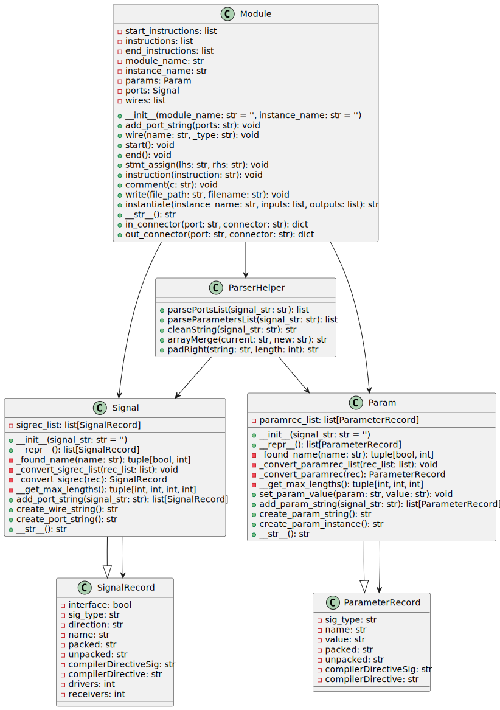

## Module Class

The `Module` class represents a SystemVerilog module, providing methods to construct, modify, and output the module's code.

### Key Features, Module Class

- Manages module structure, including start, body, and end instructions.

- Supports parameter and port management through `Param` and `Signal` classes.

- Allows adding and manipulating wires, assignments, and general instructions.

### Methods, Module Class

- `add_port_string`: Adds ports to the module.
- `wire`: Adds a wire definition.
  `start`: Prepare the start section of the module.
- `end`: Finalizes the module with an `endmodule` statement.
- `stmt_assign`: Adds an assignment statement.
- `instruction`: Adds a custom instruction.
- `comment`: Adds a comment line.
- `write`: Write the module to a file.
- `instantiate`: Generates instantiation code for the module.

---

## ParserHelper Class

A utility class providing static methods to parse and process SystemVerilog code elements.

### Key Features, ParserHelper Class

- Offers methods for parsing and manipulating signals and parameters.

- Includes functionalities like merging arrays, detecting ranges, and cleaning code strings.

### Methods, ParserHelper Class

- `processSignalFreeform`: Processes freeform signal strings.

- `processSignal`: Processes a text signal into a record.

- `getArrays`, `removeArrays`: Manage array dimensions in signals.

- `cleanString`: Cleans and prepares a code string for parsing.

---

## Signal Class

Manages a list of signal records, encapsulating a SystemVerilog module's operations on signal elements.

### Key Features, Signal Class

- Parses and stores individual signal definitions.

- Provides methods to output formatted signal declarations.

### Methods, Signal Class

- `add_port_string`: Parses and adds signal definitions from a string.

- `create_wire_string`: Creates a formatted string for wire definitions.

- `create_port_string`: Formats signal information for port declarations.

---

## Param Class

Handles the parameter definitions of a SystemVerilog module, managing their storage, parsing, and formatting.

### Key Features, Param Class

- Manages a list of parameter records.

- Supports adding, finding, and setting parameter values.

### Methods, Param Class

- `add_param_string`: Parses and adds parameter definitions from a string.

- `create_param_string`: Generates a formatted string for parameter declarations.

- `create_param_instance`: Creates a string for parameter instances in module instantiation.

---

## Usage in SystemVerilog Module Generation

These classes work together to provide a structured and programmable approach to generating SystemVerilog modules. The `Module` is the primary class, utilizing `Signal` and `Param` for handling ports and parameters. `ParserHelper` aids in parsing and formatting operations, ensuring the generated code aligns with SystemVerilog syntax and standards.

---

## Block Hierarchy and Links

- [Module Class](module)
- [Parser Helper Class](verilog_parser)
- [Signal Class](signal)
- [Parameter Class](param)
- [Utils](utils)

---

[Back to Scripts Index](index)

---
