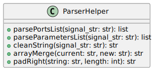

The `verilog_parser` module, located at `rtl_generators/verilog/verilog_parser.py`, provides classes and methods for parsing Verilog code, specifically module declarations, including parameters and port lists. It defines two main classes: `ParserHelper` and `Parser`.

## ParserHelper

This class includes several static methods used throughout the parsing process, aiding in manipulating and understanding Verilog signal and module syntax.

### Methods

- **processSignalFreeform(strVal, pDir, pType)**

Processes a freeform string of code and extracts a list of signal records.

- **processSignal(strVal, pDir, pType)**

Processes a textual representation of a signal, returning a signal record dictionary.

- **isNumber(strVal)**

Determines if the provided string represents a number.

- **getLeftRight(strVal)**

Parses a SystemVerilog array range and returns the left and right bounds.

- **getMax(strValA, strValB)**

Returns the maximum value between two strings, preferring non-numeric strings.

- **getMin(strValA, strValB)**

Returns the minimum value between two strings, preferring non-numeric strings.

- **arrayMerge(strValA, strValB, strName)**

Merges two array ranges into a single range string.

- **isRange(strVal)**

Check if the string represents a SystemVerilog range.

- **isInterface(strVal)**

Determines if the string represents an interface in module port definitions.

- **getArrays(strVal)**

Extracts SystemVerilog array range(s) from a string.

- **removeArrays(strVal)**

Removes array range(s) from a string.

- **padRight(strVal, maxLen)**

Pads spaces to the right of the string to reach a specified maximum length.

- **getNameAndType(strVal)**

Splits a string into a type and name, which is helpful for parsing port and parameter declarations.

- **removeMultiLineComments(strVal)**

Removes multiline comments from a string.

- **cleanString(string)**

Cleans a string for parsing, which involves eliminating comments, flattening, and removing extraneous characters.

- **parsePortsList(portStr)**

Parses a list of ports from a string and returns a detailed list of dictionaries for each port.

- **parseParametersList(paramStr)**

Parses a list of parameters from a string and returns a detailed list of dictionaries for each parameter.

## Parser

The `Parser` class performs higher-level parsing functions, utilizing the `ParserHelper` class for low-level tasks.

### Methods, Parser

- **\_\_parseBlock(strVal)**

Internal method for parsing a block of code enclosed in parentheses.

- **\_\_parseImportList()**

The stub method returns a list of import packages.

- **init\_\_(moduleString)**

The constructor where the main parsing occurs. It processes a string representing a module declaration in Verilog and extracts the module's name, parameters, ports, and import statements.

- **getModuleName()**

Returns the module's name.

- **getParametersList()**

Returns a list of parsed parameters.

- **getPortsList()**

Returns a list of parsed ports.

- **getImportList()**

Returns a list of parsed import packages.

This module helps Verilog developers analyze and manipulate Verilog code by providing detailed breakdowns of module structures, parameters, and ports, simplifying the process of generating representation or for further code analysis.

---

## Block Hierarchy and Links

- [Module Class](module)
- [Parser Helper Class](verilog_parser)
- [Signal Class](signal)
- [Parameter Class](param)
- [Utils](utils)

---

[Back to Scripts Index](index)

---
