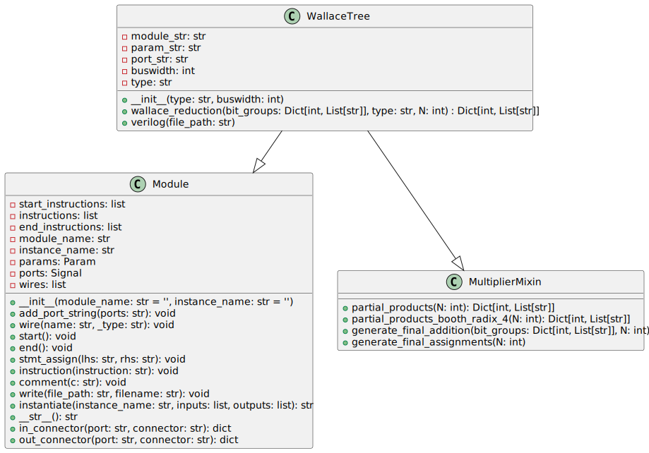

## Overview

The `WallaceTree` class in the `wallace_multiplier.py` file is a Python class for generating Verilog module code for a Wallace Tree multiplier. This structure performs fast multiplication operations in hardware by reducing the partial products to minimize the delay.



## Inputs/Outputs

- `input [N-1:0] i_multiplier`: The multiplier operand of the buswidth `N`.

- `input [N-1:0] i_multiplicand`: The multiplicand operand of the buswidth `N`.
  `output [2*N-1:0] ow_product`: The multiplication's output product is twice the buswidth `N`.

## Class `WallaceTree` Functionality

- Inherits from `Module` and `MultiplierMixin`.

- Allows the configuration of the buswidth `N` and the type of addition (`full adder` or `carry-save adder`).

- The `wallace_reduction` method for the Wallace tree reduction.

- The `verilog` method is responsible for generating the Verilog code.

## Important Methods

### 1. Constructor `__init__(self, type, buswidth)`

Initializes the WallaceTree module with specified type and buswidth.

### 2. `wallace_reduction(self, bit_groups, type, N)`

Performs the Wallace reduction on partial products and returns the reduced bit groups.

- `bit_groups`: Dictionary containing the bit groups for reduction.

- `type`: Specifies whether to use a full adder ('fa') or carry-save adder ('csa').

- `N`: The buswidth for the multiplication operation.

#### Example Usage

```python

multiplier = WallaceTree('csa', 8)

bit_groups = {...} # Dictionary populated with bit groups

reduced_bit_groups = multiplier.wallace_reduction(bit_groups, 'csa', 8)

```

### 3. `verilog(self, file_path)`

This method generates the Verilog code for the Wallace Tree multiplier and writes it to a file with the provided file path.

- `file_path`: The save file path where the `.sv` file.

## Verilog File Generation

Upon invoking the `verilog()` method on an instance of `WallaceTree`, the following sequence of events takes place:

- Generation of partial products.

- Applying Wallace reduction to the partial products.

- Final addition stage generation.

- Generating assignments from the reduced bit groups to the output product.

- Synthesis controls for simulation are included, with a dump file for waveform analysis.

## Usage

To generate a Wallace Tree multiplier with a specific buswidth and adder type, you would create an instance of the `WallaceTree` class and call the `verilog` method.

```python

# Example instantiation and Verilog code generation

wallace_multiplier_instance = WallaceTree('csa', 8)

wallace_multiplier_instance.verilog('/path/to/save/generated/verilog.sv')

```

By allowing the user to specify the adder type and the buswidth, this approach provides a flexible and reusable mechanism for generating Wallace Tree multipliers tailored to particular use cases## Block Hierarchy and Links

---

## Block Hierarchy and Links

- [Dadda Multiplier](dadda_multiplier)
- [Wallace Multiplier](wallace_multiplier)
- [Multiplier Mixin Logic](multiplier_mixin)
- [Utils](utils)

---

[Back to Scripts Index](index)

---
