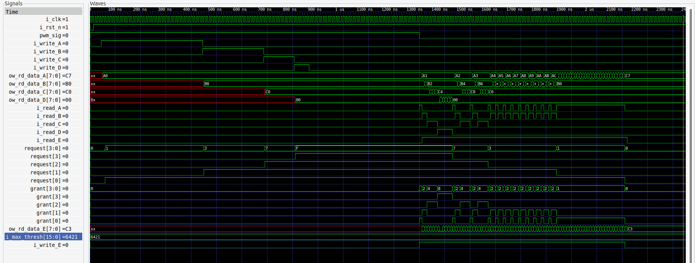

## Wrapper Block Diagram

## Verilog Wrapper: `weighted_round_robin_wrapper`

- **Purpose**: Implements a weighted round-robin arbiter with multiple FIFOs.
- **Parameters**:
  - `N`: Number of clients (default: 4).
- **Inputs**:
  - Clock (`i_clk`), reset (`i_rst_n`), write enable signals, write data for each FIFO (`i_write_A` to `i_write_D`, `i_wr_data_A` to `i_wr_data_D`), and start signal for PWM (`start_pwm`).
- **Outputs**:
  - Flags indicating if each FIFO is full (`ow_wr_full_A` to `ow_wr_full_D`) and read enable for FIFO E (`i_read_E`).
- **Internal Components**:
  - Four instances of `fifo_sync` for FIFOs A to D with varying data depths.
  - A PWM module (`u_pwm`). The PWM is there to simplify testing; it blocks the arbiter from granting until it is released. This allows us to fill all of the FIFOs and let them train in a controlled fashion.
  - Weighted round-robin arbiter (`weighted_round_robin_inst`).
- **Functionality**:
  - Manages four FIFOs and allocates access to a fifth FIFO (E) based on the round-robin algorithm.
  - Generates PWM signals and interfaces with the arbiter for masking requests from the FIFOs.

## Cocotb Testbench: `test_fifo`

**Purpose**: Validate the functionality of the weighted round-robin wrapper.

- **Test Steps**:

  1. Initialize all inputs to zero and start the clock.
  2. Perform reset operations.
  3. Start the PWM signal.
  4. Fill FIFOs A to D with specific data values (160+i for A, 176+i for B, 192+i for C, and 208+i for D). Note: I use deterministic data to make tracking the data coming out of FIFO D easy.
  5. Continuously check and wait if FIFOs are full before writing to them.
  6. Simulate for additional clock cycles to observe the round-robin behavior.

- **Key Assertions**:
  - Ensures data is written correctly to FIFOs.
  - Observe the round-robin arbitration in action.
  - Checks the functionality of the PWM module in conjunction with the FIFO operations.

### Simulation Overview

- During the early part of the simulation, the PWM signal asserts, blocking the grants. The queues are filled to various depths so that we may view the queues getting different service levels based on the weighted threshold. The credit distribution is A=1, B=2, C=4, D=6.
- The critical observation is the last signal in the waveform, i_write_E. The i_write_E signal is an OR of all the grant signals. Notice it is always high throughout the simulation. Some arbiters put "dead" cycles between arbitration states. Dead cycles are inefficient.
- The other item this waveform is helpful for is to notice the different time lengths that the i*read*\* signals assert. This time variance is from the different thresholds.

### Arbiter Internals

---

[Back to Scripts Index](index)
