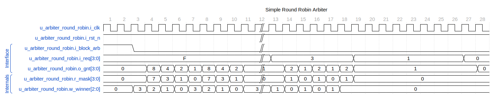
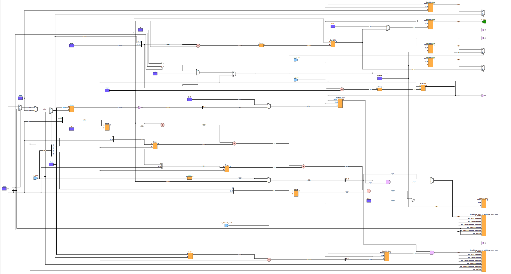

# arbiter_round_robin

## Overview

The `arbiter_round_robin` module is a round-robin arbiter implemented in SystemVerilog. It manages multiple clients' requests and grants access to one client at a time in a rotating manner. It ensures fair and orderly access to shared resources by cycling through clients in a fixed order.

## Parameters

- `CLIENTS` (integer, default: 4): Number of clients requesting access.
- `WAIT_GNT_ACK` (integer, default: 0): If set to 1, the arbiter waits for acknowledgment of grant before proceeding to the next client.

## Ports

### Inputs

- `i_clk` (logic): Clock signal.
- `i_rst_n` (logic): Active-low reset signal.
- `i_block_arb` (logic): Block arbiter signal.
- `i_req` (logic [CLIENTS-1:0]): Request signals from clients.
- `i_gnt_ack` (logic [CLIENTS-1:0]): Grant acknowledgment signals from clients.

### Outputs

- `o_gnt_valid` (logic): Indicates a valid grant is output.
- `o_gnt` (logic [CLIENTS-1:0]): One-hot grant signals to the clients.
- `o_gnt_id` (logic [N-1:0]): Grant ID indicating which client was granted access.

## Functionality

The module implements a fair round-robin arbitration scheme. It cycles through client requests and grants access to one client while ensuring that no client gets consecutive grants unless there are no other requests.

- **Request Masking:** Masks are used to handle priority and ensure fair access.
- **Leading and Trailing One Detection:** Determines the highest priority request using `leading_one_trailing_one` instances.
- **Winner Selection Logic:** Determines which client request wins the arbitration.
- **Grant Outputs:** Sets the grant outputs based on the arbiter decision.

### Detailed Operations

1. **Request Handling:**
   - Requests are masked if arbitration is blocked (`i_block_arb`).
   - Requests are masked with previously stored masks to avoid double granting.

2. **Winner Determination:**
   - Uses `leading_one_trailing_one` to find the highest priority request.
   - Chooses between masked and unmasked requests based on validity.

3. **Mask Updates:**
   - Updates internal masks when a client is granted access to ensure fair rotation.

4. **Grant Output:**
   - Sets the grant signals and valid signals based on the selected winner.

## Waveforms

All requests are pegged high in this start portion of the weighted round-robin. The grants start at the upper bit in this implementation and work their way down. In the later part of the simulation, the arbiter alternates between agent zero and agent one. Finally, when agent 1 runs out of requests, the arbiter sticks with agent 0 without injecting bubbles.

## Diagram, assuming four clients

---

[Return to Index](index.md)

---
