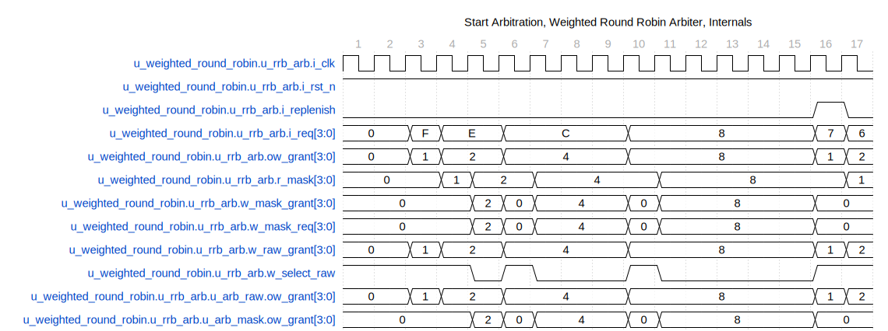
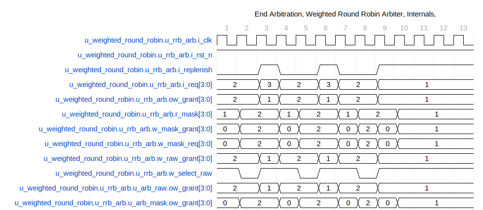

# arbiter_round_robin_subinst

## Overview

This SystemVerilog module implements a parameterized round-robin arbiter, which is used to manage access to a shared resource among multiple clients. The design ensures that each client gets fair access according to a round-robin scheduling algorithm.

## Functionality

The core functionality of the `arbiter_round_robin_subinst` module can be summarized as follows:

- **Client Arbitration**: It selects one of the multiple client requests based on a round-robin strategy.
- **Request Masking**: It uses a masking technique to manage client requests that have already been given access.
- **Grant Signals**: It generates grant signals to indicate which client has been granted access.
- **Replenish Control**: It can handle a replenish signal to reset the masking and start a new round of arbitration.

## Parameters

- `CLIENTS`: Number of clients requesting access.
- `WAIT_GNT_ACK`: Control to wait for grant acknowledgment.

## Ports

- `i_clk`: Clock signal input.
- `i_rst_n`: Active-low reset signal input.
- `i_req`: Input requests from clients.
- `i_replenish`: Replenish control signal input.
- `ow_grant`: Output grant signals for each client.
- `i_gnt_ack`: Input acknowledgment signals from clients.

## Internal Signals

- `r_mask`: Register to mask clients that have already been granted access.
- `w_mask_req`: Masked request signal.
- `w_raw_grant`, `w_mask_grant`: Raw and masked grant signals.
- `w_select_raw`: Control signal to select between raw and masked grants.

## Operations

### Mask Update Logic

The mask update logic runs on every clock edge and ensures that only clients which have not been granted access or have acknowledged the grant can modify the output grant (`ow_grant`).

```verilog
always_ff @(posedge i_clk or negedge i_rst_n) begin
    if (~i_rst_n)
        r_mask <= {CLIENTS{1'b1}};
    else begin
        r_mask <= {CLIENTS{1'b0}};
        for (int i = 0; i < CLIENTS; i++) begin
            if (ow_grant[i])
                if (~WAIT_GNT_ACK || i_gnt_ack[i])
                    r_mask[i] <= 1'b1;
        end
    end
end
```

### Masked Requests

Requests are masked using the `r_mask` register to generate `w_mask_req`.

```verilog
assign w_mask_req = i_req & r_mask;
```

### Grant Signals

Two fixed-priority arbiters generate raw and masked grants. The final grant is chosen based on the `w_select_raw` signal.

```verilog
arbiter_fixed_priority #(CLIENTS) u_arb_raw (
    .i_req(i_req),
    .ow_grant(w_raw_grant)
);

arbiter_fixed_priority #(CLIENTS) u_arb_mask (
    .i_req(w_mask_req),
    .ow_grant(w_mask_grant)
);
```

### Grant Selection

The final grant is determined by whether the mask needs to be replenished or if all masked requests are zero, in which case, a raw grant is provided.

```verilog
assign w_select_raw = i_replenish || (w_mask_req == {CLIENTS{1'b0}});
assign ow_grant = w_select_raw ? w_raw_grant : w_mask_grant;
```

## Waveforms



In this waveform, we notice ow_grant cycles from agent 0 to agent 3, each with more extended grant periods. The grant periods 1, 2, 4, and 6 clocks respectively. Notice that the grant remains asserted even through switching agents.



The second waveform shows switching between agent 0 and agent 1. Notice replenish happens more often. Eventually, when only agent 0 has a request and it only has one credit, replenish remains stuck at one.

## Usage

This module can be instantiated in a SystemVerilog design where multiple clients need managed access to a shared resource. Users can set the number of clients and specify whether to wait for grant acknowledgment. It is expected that it is a sub-block of the weight round robin arbiter.

## Block Hierarchy and Links

- [Weighted Round Robin](arbiter_weighted_round_robin.md)
- [Arbiter Sub Instance](arbiter_round_robin_subinst.md)
- [Arbiter Fixed Priority](arbiter_fixed_priority.md)

---

## Usage in tests

- TBD

---

[Return to Index](index.md)

---
