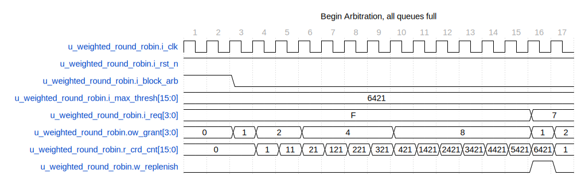
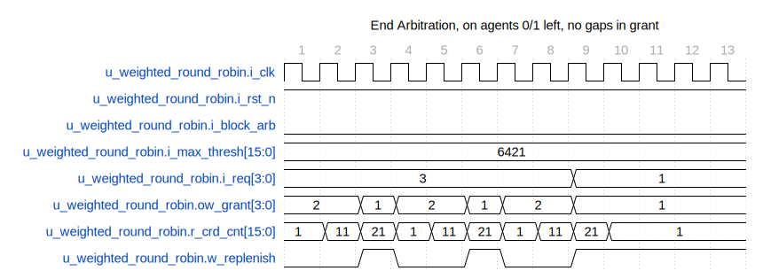

# arbiter_weighted_round_robin

This SystemVerilog module implements a **Weighted Round Robin Arbiter**. The design ensures fair resource allocation among multiple clients based on defined weights, even under heavy contention. Round-robin arbitration guarantees each client receives service in a cyclic order, while weights adjust the frequency of service.

## Functionality

- **Weighted Fairness:** Each client has a credit system that represents its weight. More credits mean higher priority for receiving grants.
- **Credit Replenishment:** Credits are replenished when no requests have associated credits, ensuring continual operation.
- **Round Robin Integration:** Uses a round-robin algorithm to resolve which client gets the grant when multiple requests are pending.
- **Request Blocking:** The system supports a mechanism to block arbitration for all clients simultaneously.
- **Acknowledgment** Handling:**** Incorporates an optional mechanism for acknowledgment of grants before credit updates (`WAIT_GNT_ACK`).

## Operations

### Parameters

- `MAX_THRESH`: Maximum threshold for credits.
- `MAX_THRESH_WIDTH`: Bit-width for representing the maximum threshold.
- `CLIENTS`: Number of clients competing for arbitration.
- `WAIT_GNT_ACK`: Flag for enabling wait for grant acknowledgment before credit update.

### Inputs and Outputs

- **Inputs**
  - `i_clk`: Clock signal.
  - `i_rst_n`: Reset signal (active low).
  - `i_block_arb`: Signal to block arbitration.
  - `i_max_thresh`: Maximum thresholds for each client in a flattened array.
  - `i_req`: Request signals from clients.
  - `i_gnt_ack`: Acknowledgment signals for grants.

- **Outputs**
  - `ow_gnt_valid`: Grant validity signal.
  - `ow_gnt`: Grant signals for clients.
  - `ow_gnt_id`: Grant ID for the granted client.

### Logic Descriptions

1. **Initialization and Declarations**
    - Local parameters and signals for credit management and request handling are initialized.
    - Comb and flip-flop signals are defined for operations.

2. **Combinational Logic**
    - Generates masked requests based on available credits and block arbitration signal.
    - Determines when to replenish credits.

3. **Credit Management Per Client**
    - Calculates credit increments.
    - Updates credit counters based on grants and replenishment conditions.
    - Generates masked requests ensuring only valid requests depending on credit availability are considered.

4. **Round Robin Arbitration**
    - Masked requests are fed into the round-robin arbiter submodule.
    - Determines the granted client following round-robin logic.

5. **Grant Identification**
    - Converts one-hot grant signal to an index to identify the granted client.

## Waveforms

All requests are pegged high in this start portion of the weighted round-robin. The signal r_crd_cnt adds one to each agent's count as granted. The grant will remain asserted while the request is active and the agent has credits available. In cycle 16, the credits for all agents are consumed, so replenish asserts.

In this waveform, only agents zero and one assert a request. These agents have very few credit counts (1 and 2, respectively.) Notice the replenish signal toggles more frequently.

### Conclusion

The weighted round-robin arbiter presented here is a flexible solution for managing competing resource requests. It can be customized to fit various use cases and ensures fair distribution of access based on pre-defined weights.

---

## Block Hierarchy and Links

- [Weighted Round Robin](arbiter_weighted_round_robin.md)
- [Arbiter Sub Instance](arbiter_round_robin_subinst.md)
- [Arbiter Fixed Priority](arbiter_fixed_priority.md)

---

[Return to Index](index.md)

---
