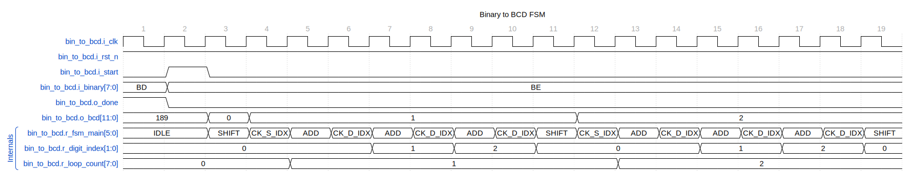

# Cheat Sheet for the main scripts

The main scripts handle the command line parsing and instantiate the underlying classes, which do all the work.

This document will evolve as more scripts get added, showing the most common use cases for the scripts.

## CocoTB Testing with pytest

The tests for the rtl/* areas are all in val/unit_*. Most of the tests are parameterized to test many different configurations.
To run all of one of the tests in unit_* areas, cd to that area and type:
`pytest`

if you want to run one test type:
`pytest <test name>`

## [lint_wrap.py](lint_wrap.md)

The `lint_wrap` script at `lint_wrap.py` is to lint and format Verilog files using supporting functions encapsulated in a `Lint` class. This script acts as a command-line interface (CLI) utility for code maintenance. The utility offers the following options:

```sh

python3 bin/lint_wrap.py --format

python3 bin/lint_wrap.py --lint

python3/lint_wrap.py --format --lint

```

The format option uses a verible format to ensure all code follows a convention. The lint option runs verible lint. Verible issues are available for waivers.

```verilog

parameter INSTANCE_NAME = "DEADF1F0" // verilog_lint: waive explicit-parameter-storage-type

```

## [math_generate.py](math_generate.md)

This script generates many versions of math structures: BrentKung, Wallace, and Dadda. Here is an example of a BrentKung:

```sh

out_path='./math_outputs/bk_08'

if [ ! -d "\$out_path" ]; then

mkdir -p "\$out_path"

echo "Directory '\$out_path' created."

else

echo "Directory '\$out_path' already exists."

fi

rm -f \$out_path/*

# Adder Type

type='brent_kung'

# Bitwidth

buswidth=8

python3 bin/math_generate.py --type \$type --path \$out_path --buswidth \$buswidth
```
## [vcd2wavedrom2.py](vcd2wavedrom2.md)

This script generates wavedrom files based on vcd and gtkw files. The gtkw file provides the signal selection, grouping and ordering, and adding hierarchical labels to the signals.

### Step 0: cd to the area with the simulation

### Step 1: Create the config file

```sh
python3 $REPO_ROOT/bin/vcd2wavedrom2/vcd2wavedrom2.py -i waves.vcd -m config.json     # This will grab all of the signals in the vcd

python3 $REPO_ROOT/bin/vcd2wavedrom2/vcd2wavedrom2.py -i waves.vcd -m config.json -hl u_weighted_round_robin -s "1290ns" -e "1320ns"
# the -hl specifies a hierarchy to grab from the vcd; one or more may be passed in the -s/-e also specify the start and end times for the waveform.
```

Here is what the configuration JSON file looks like when created. Adjust the signal order to your liking. Ideally, the sample rate should match the clock period.

```json
{
    "filter": [
        "u_fifo_sync_A.i_clk",
        "u_fifo_sync_A.i_read",
        "u_fifo_sync_A.i_rst_n",
        "u_fifo_sync_A.i_wr_data[7:0]",
        "u_fifo_sync_A.i_write",
        "u_fifo_sync_A.o_rd_almost_empty",
        "u_fifo_sync_A.ow_rd_data[7:0]",
        "u_fifo_sync_A.o_rd_empty",
        "u_fifo_sync_A.o_wr_almost_full",
        "u_fifo_sync_A.o_wr_full",
        "u_fifo_sync_A.r_rd_addr[5:0]",
        "u_fifo_sync_A.r_rd_ptr_bin[6:0]",
        "u_fifo_sync_A.r_wr_addr[5:0]",
        "u_fifo_sync_A.r_wr_ptr_bin[6:0]",
        "u_fifo_sync_A.w_almost_empty_count[5:0]",
        "u_fifo_sync_A.w_almost_full_count[5:0]",
        "u_fifo_sync_A.w_ptr_xor",
        "u_fifo_sync_A.read_counter.i_enable",
        "u_fifo_sync_A.read_counter.i_rst_n",
        "u_fifo_sync_A.read_counter.o_counter_bin[6:0]",
        "u_fifo_sync_A.write_counter.i_enable",
        "u_fifo_sync_A.write_counter.i_rst_n",
        "u_fifo_sync_A.write_counter.o_counter_bin[6:0]"
    ],
    "name": "Fifo Behavior",
    "tock": 1,
    "samplerate": "10ns",
    "hscale": 1,
    "clocks": [
        {
            "name": "u_fifo_sync_A.i_clk",
            "char": "p",
            "period": "10ns"
        }
    ],
    "starttime": ["1290ns", "1770ns"],
    "endtime": ["1460ns", "1900ns"],
    "phase_clk": 0,
    "phase_reg": 0,
    "phase_wir": 0
}

```

Fields:

* samplerate: The frequency of the signals is sampled and homogenized from the VCD file.

* hscale: The horizontal scale for this drawing.

* clocks: The clocks, the character to use, e.g., pPnN, and the calculated clock period from the VCD.

* starttime: a list of times in ns/ps used to draw a portion of the waveform.

* endtime: a list of times in ns/ps used to draw a portion of the waveform.

* phase_*: optional phase adjustments for signal types.

* enum_list: shown below, this lets one enumerate the FSM state names

### Step 1.25: Update the config file. One may want to remove or reorganize the signals. One may also want to put the units into something consistent, like ns

### Step 1.5: Update the *.gtkw file if desired. The gtkw file adds hierarchy to the signals listed. Below is a sample gtkw file for FIFO listed above

```python
weighted_round_robin_wrapper.u_fifo_sync_A.i_clk
weighted_round_robin_wrapper.u_fifo_sync_A.i_rst_n
-Write Interface
weighted_round_robin_wrapper.u_fifo_sync_A.i_write
weighted_round_robin_wrapper.u_fifo_sync_A.i_wr_data[7:0]
--ptr
weighted_round_robin_wrapper.u_fifo_sync_A.write_counter.o_counter_bin[6:0]
weighted_round_robin_wrapper.u_fifo_sync_A.o_wr_almost_full
weighted_round_robin_wrapper.u_fifo_sync_A.o_wr_full
-Read Interface
weighted_round_robin_wrapper.u_fifo_sync_A.i_read
weighted_round_robin_wrapper.u_fifo_sync_A.ow_rd_data[7:0]
--ptr
weighted_round_robin_wrapper.u_fifo_sync_A.read_counter.o_counter_bin[6:0]
weighted_round_robin_wrapper.u_fifo_sync_A.o_rd_almost_empty
weighted_round_robin_wrapper.u_fifo_sync_A.o_rd_empty

```

Notice signals have -Write/Read Interface and ptr markings. By default, GTKWave adds a '-' in front of comment lines in the gtkw file. To add more hierarchy levels, add more '-' when adding comments to the waveform or edit the gtkw file afterward. Note: there may be many signals in the configuration JSON. However, only those signals used in the GTKW file (when using this option) appear in the final wavedrom.

### Step 2: Generate the wavedrom file

Here is the command to generate the FIFO waveform.

```sh
python3 $REPO_ROOT/bin/vcd2wavedrom2/vcd2wavedrom2.py -i waves.vcd -c config_fifo.json -o wavedrom_fifo_start_end.json -g fifo.gtkw
perl -pi -e 's/weighted_round_robin_wrapper.//' wavedrom_fifo_start_end.json

```

There are two commands shown here. The first one makes the wavedrom file (wavedrom_fifo_start_end.json), and the second line removes an extra level of hierarchy from the signal names to make them easier to read.

Here is what the final product looks like:


### An Enumerated FSM example

Here is the JSON file for an enumerated FSM:

```json
{
    "filter": [
        "bin_to_bcd.i_binary[7:0]",
        "bin_to_bcd.i_clk",
        "bin_to_bcd.i_rst_n",
        "bin_to_bcd.i_start",
        "bin_to_bcd.o_bcd[11:0]",
        "bin_to_bcd.o_done",
        "bin_to_bcd.r_fsm_main[5:0]"
    ],
    "name": "Binary to BCD FSM",
    "tock": 1,
    "samplerate": "10ns",
    "hscale": 2,
    "clocks": [
        {
            "name": "bin_to_bcd.i_clk",
            "char": "p",
            "period": "10ns"
        }
    ],
    "starttime": [
        "115940ns"
    ],
    "endtime": [
        "116130ns"
    ],
    "phase_clk": 0,
    "phase_reg": 0,
    "phase_wir": 0,
    "enum_list" : [{"name":"bin_to_bcd.r_fsm_main[5:0]", 
                    "enum":{"1" :"IDLE", 
                            "2" :"SHIFT",
                            "4" :"CK_S_IDX",
                            "8" :"ADD", 
                            "10":"CK_D_IDX",
                            "20":"BCD_DONE"}}]
}

```

The enum_list is a list of dictionaries. So, more than one FSM could be enumerated this way.



---

[Back to Scripts Index](index.md)

---
