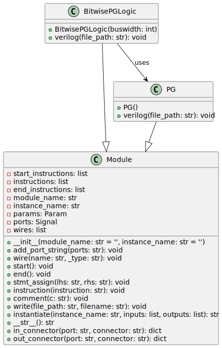

# bitwise_pg_logic

This is part of the python code that creates adders/multipliers.



## Inputs/Outputs

- **Inputs:**
  - `i_a[N-1:0]`: Operand A, where N is the bus width.
  - `i_b[N-1:0]`: Operand B, where N is the bus width.
  - `i_c`: Input carry.

- **Outputs:**
  - `ow_g[N:0]`: Output generate signals, indicating where carries are generated.
  - `ow_p[N:0]`: Output propagate signals, indicating where a carry would propagate through.

## Internal Functionality

- The module uses a generate-for loop which iterates over the bit-width of the operands.
- Within the loop, instances of the `math_adder_brent_kung_pg` module are created for each bit to calculate propagate and generate signals.
- Output propagate and generate signals for bit position 0 are handled outside the loop; propagate is set to '0', and generate is set to the input carry.

## Command Line Options

- This Python code does not directly interact with command line options, it is intended to be used as part of a larger build or script execution process that might pass the bus width and output file path as parameters to the Python script.

```python
# After the verilog() function is invoked on an instance of the BitwisePGLogic class,
# the corresponding Verilog code for the specified bus width will be written to the specified file path.
bitwise_pg_logic_instance.verilog(file_path)
```

(Note: The specific instantiation and calling of the `verilog()` method are not included in the above code snippet; they must be done in accordance with the broader context in which this Python class is used.)

---

[Back to Scripts Index](index.md)
