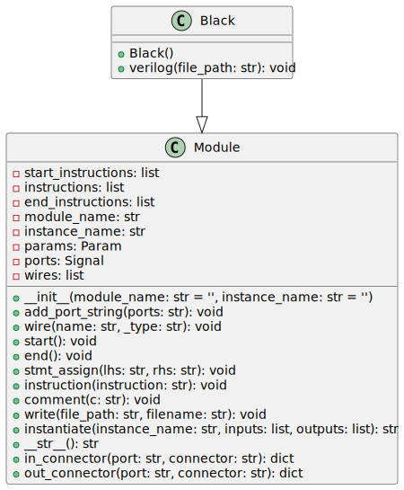

# Black

The `Black` class is a Python module found at `rtl_generators/adders/brentkung/black.py`. It inherits from the `Module` class in `rtl_generators.verilog.module`. Its purpose is to generate Verilog code for a specific component used in Brent-Kung adder circuits, which is primarily used to compute the generate (`g`) and propagate (`p`) signals at each stage of the adder.


## Code Documentation

The `Black` class defines a piece of combinatorial logic which typically forms a part of a Brent-Kung parallel-prefix adder, specifically responsible for computing an intermediate generate and propagate signal, which will be used in further stages of the adder for computing the carry signals.

### Inputs/Outputs

The `Black` class specifies the following ports as Verilog inputs/outputs:

- `i_g`: Input logic signal representing the generate value from the current stage.
- `i_p`: Input logic signal representing the propagate value from the current stage.
- `i_g_km1`: Input logic signal representing the generate value from the previous stage (`k-1`).
- `i_p_km1`: Input logic signal representing the propagate value from the previous stage (`k-1`).
- `ow_g`: Output logic signal representing the output generate value (`g = i_g | (i_p & i_g_km1)`).
- `ow_p`: Output logic signal representing the output propagate value (`p = i_p & i_p_km1`).

### Internal Functionality

- `__init__`: The initializer sets the module name to `'math_adder_brent_kung_black'` and adds the defined ports.
- `verilog`: It is responsible for generating the Verilog code for the block. This includes:
  - Calling the `start()` method of the parent class to initiate code generation.
  - Using `stmt_assign` to create assignments for `ow_g` and `ow_p`. The `ow_g` output is a logical OR between `i_g` and the logical AND of `i_p` and `i_g_km1`. The `ow_p` output is a logical AND between `i_p` and `i_p_km1`.
  - Calling the `end()` method of the parent class to finalize code generation.
  - Writing the generated Verilog code to a file with a name based on the module name and a `.sv` file extension, in the given `file_path`.

### Usage

To instantiate and use the `Black` class for generating Verilog code, one must import the class and create an instance of it, after which the `verilog` method is called with an appropriate `file_path` where the `.sv` file should be written.

### Example

```python
black_instance = Black()
black_instance.verilog('/path/to/output_directory')
```

Command Line Options:

There are no command line options for this block of code since it is intended to be used within a Python script or interactive session to generate the Verilog code. The `file_path` parameter to the `verilog` method determines where the Verilog file will be saved.

After generating this documentation, two new lines can be added for visual separation.

---

[Back to Scripts Index](index.md)
