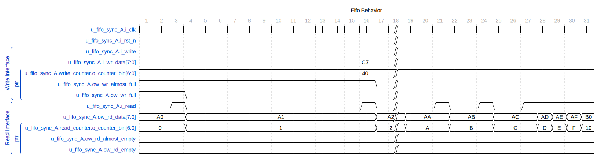

# Cheat Sheet for the main scripts

The main scripts handle the command line parsing and instantiate the underlying classes, which do all the work.

This document will evolve as more scripts get added, showing the most common use cases for the scripts.

## [lint_wrap.py](lint_wrap.md)

The `lint_wrap` script at `lint_wrap.py` is to lint and format Verilog files using supporting functions encapsulated in a `Lint` class. This script acts as a command-line interface (CLI) utility for code maintenance. The utility offers the following options:

```sh

lint_wrap.py --format

lint_wrap.py --lint

lint_wrap.py --format --lint

```

The format option uses a verible format to ensure all code follows a convention. The lint option runs verible lint. Verible issues are available for waivers.

```verilog

parameter INSTANCE_NAME = "DEADF1F0" // verilog_lint: waive explicit-parameter-storage-type

```

## [list_test_wrap.py](list_test_wrap.md)

The following code provides the functionality of a wrapper script to work with test lists in a Python project. It is designed to perform operations related to test management, specifically finding test commands and generating a JSON file list of tests.

Find test commands using a simulation partial test name:

```sh

list_test_wrap.py --find "add"

```

Output:

```sh

python run_test_wrap.py --test val/common_cocotb_only/math_adder_brent_kung_008 --tag my_tag --seed 1234

python run_test_wrap.py --test val/common_cocotb_only/math_adder_brent_kung_016 --tag my_tag --seed 1234

python run_test_wrap.py --test val/common_cocotb_only/math_adder_brent_kung_032 --tag my_tag --seed 1234

python run_test_wrap.py --test val/common_cocotb_only/math_adder_carry_lookahead --tag my_tag --seed 1234 --params N=4

python run_test_wrap.py --test val/common_cocotb_only/math_adder_carry_save --tag my_tag --seed 1234

python run_test_wrap.py --test val/common_cocotb_only/math_adder_carry_save_nbit --tag my_tag --seed 1234 --params N=4

python run_test_wrap.py --test val/common_cocotb_only/math_adder_full --tag my_tag --seed 1234

python run_test_wrap.py --test val/common_cocotb_only/math_adder_full_nbit --tag my_tag --seed 1234 --params N=4

python run_test_wrap.py --test val/common_cocotb_only/math_adder_half --tag my_tag --seed 1234

python run_test_wrap.py --test val/common_cocotb_only/math_adder_hierarchical --tag my_tag --seed 1234 --params N=16,C=6

python run_test_wrap.py --test val/common_cocotb_only/math_adder_kogge_stone_nbit --tag my_tag --seed 1234 --params N=4

python run_test_wrap.py --test val/common_cocotb_only/math_adder_ripple_carry --tag my_tag --seed 1234 --params N=4

python run_test_wrap.py --test val/common_cocotb_only/math_addsub_full_nbit --tag my_tag --seed 1234 --params N=8

```

Generate a JSON list of tests specifying a path and output file name (for each bin of tests, level0, level1, etc., there is an associated in ./val/testlists/level0.json. These JSON files contain the parameters and the seed used for the test. Creating the JSON list with the information from the makefile is hard to grab manually.):

```sh

list_test_wrap.py --list "level0.json" --path "val/common_cocotb_only/"

```

Here is an example of the JSON file:

```python

{

"rtl_dirs": [

"rtl/common",

"rtl/xilinx"

],

"test_lists": {

"level0": "val/testlists/level0.json"

},

"make_clean" : "val/common_cocotb_only/cleanall.mk",

"lint_reports": {"lint":"./reports/lint/", "verible":"./reports/verible/"}

}

```

## [run_test_wrap.py](run_test_wrap.md)

The following Python script, `run_test_wrap.py`, is a wrapper used to execute one or multiple tests within a testing framework by leveraging the functionality provided by the `RunTest` class from the `project_automation.run_test` module. It uses the levelX.json file to know the parameters and the seed.

Examples:

```sh

# run one test

run_test_wrap.py --test val/common_cocotb_only/arbiter_round_robin --tag 122423 --seed 1234 --params CLIENTS=6

# run level0

run_test_wrap.py --testlist level0 --tag 122423

```

The script creates a regression directory for the level0 regression, the repo_root level. Inside this is another directory called "tag" to hold all this run together.

## [math_generate.py](math_generate.md)

This script generates many versions of math structures: BrentKung, Wallace, and Dadda. Here is an example of a BrentKung:

```sh

out_path='./math_outputs/bk_08'

if [ ! -d "\$out_path" ]; then

mkdir -p "\$out_path"

echo "Directory '\$out_path' created."

else

echo "Directory '\$out_path' already exists."

fi

rm -f \$out_path/*

# Adder Type

type='brent_kung'

# Bitwidth

buswidth=8

math_generate.py --type \$type --path \$out_path --buswidth \$buswidth

```

## [vcd2wavedrom2.py](vcd2wavedrom2.md)

This script generates wavedrom files based on vcd and gtkw files. The gtkw file provides the signal selection, grouping and ordering, and adding hierarchical labels to the signals.


### Step 0: cd to the area with the simulation

### Step 1: Create the config file

```sh
python3 $REPO_ROOT/bin/vcd2wavedrom2/vcd2wavedrom2.py -i dump.vcd -m config.json     # This will grab all of the signals in the vcd

python3 $REPO_ROOT/bin/vcd2wavedrom2/vcd2wavedrom2.py -i dump.vcd -m config.json -hl u_weighted_round_robin -s "1290ns" -e "1320ns"
# the -hl specifies a hierarchy to grab from the vcd; one or more may be passed in the -s/-e also specify the start and end times for the waveform.
```

Here is what the configuration JSON file looks like when created. Adjust the signal order to your liking. Ideally, the sample rate should match the clock period.

```json
{
    "filter": [
        "u_fifo_sync_A.i_clk",
        "u_fifo_sync_A.i_read",
        "u_fifo_sync_A.i_rst_n",
        "u_fifo_sync_A.i_wr_data[7:0]",
        "u_fifo_sync_A.i_write",
        "u_fifo_sync_A.ow_rd_almost_empty",
        "u_fifo_sync_A.ow_rd_data[7:0]",
        "u_fifo_sync_A.ow_rd_empty",
        "u_fifo_sync_A.ow_wr_almost_full",
        "u_fifo_sync_A.ow_wr_full",
        "u_fifo_sync_A.r_rd_addr[5:0]",
        "u_fifo_sync_A.r_rd_ptr_bin[6:0]",
        "u_fifo_sync_A.r_wr_addr[5:0]",
        "u_fifo_sync_A.r_wr_ptr_bin[6:0]",
        "u_fifo_sync_A.w_almost_empty_count[5:0]",
        "u_fifo_sync_A.w_almost_full_count[5:0]",
        "u_fifo_sync_A.w_ptr_xor",
        "u_fifo_sync_A.read_counter.i_enable",
        "u_fifo_sync_A.read_counter.i_rst_n",
        "u_fifo_sync_A.read_counter.o_counter_bin[6:0]",
        "u_fifo_sync_A.write_counter.i_enable",
        "u_fifo_sync_A.write_counter.i_rst_n",
        "u_fifo_sync_A.write_counter.o_counter_bin[6:0]"
    ],
    "name": "Fifo Behavior",
    "tock": 1,
    "samplerate": "10ns",
    "clocks": [
        {
            "name": "u_fifo_sync_A.i_clk",
            "char": "p",
            "period": "10ns"
        }
    ],
    "starttime": ["1290ns", "1770ns"],
    "endtime": ["1460ns", "1900ns"],
    "phase_clk": 0,
    "phase_reg": 0,
    "phase_wir": 0
}

```

Fields:

* filter: Filters for the signals used.
* name: The waveform title.
* tock: the number to start the "tock" value. Tock is a number in the middle of a clock period for reference.
* samplerate: The frequency the signals are sampled and homogenized from the VCD file.
* clocks: The clocks, the character to use, e.g., pPnN, and the calculated clock period from the VCD.
* starttime: a list of times in ns/ps used to draw a portion of the waveform.
* endtime: a list of times in ns/ps used to draw a portion of the waveform.
* phase_*: optional phase adjustments for signal types.

### Step 1.25: Update the config file. One may want to remove or reorganize the signals. One may also want to put the units into something consistent, like ns.

### Step 1.5: Update the *.gtkw file if desired. The gtkw file adds hierarchy to the signals listed. Below is a sample gtkw file for FIFO listed above:

```python
weighted_round_robin_wrapper.u_fifo_sync_A.i_clk
weighted_round_robin_wrapper.u_fifo_sync_A.i_rst_n
-Write Interface
weighted_round_robin_wrapper.u_fifo_sync_A.i_write
weighted_round_robin_wrapper.u_fifo_sync_A.i_wr_data[7:0]
--ptr
weighted_round_robin_wrapper.u_fifo_sync_A.write_counter.o_counter_bin[6:0]
weighted_round_robin_wrapper.u_fifo_sync_A.ow_wr_almost_full
weighted_round_robin_wrapper.u_fifo_sync_A.ow_wr_full
-Read Interface
weighted_round_robin_wrapper.u_fifo_sync_A.i_read
weighted_round_robin_wrapper.u_fifo_sync_A.ow_rd_data[7:0]
--ptr
weighted_round_robin_wrapper.u_fifo_sync_A.read_counter.o_counter_bin[6:0]
weighted_round_robin_wrapper.u_fifo_sync_A.ow_rd_almost_empty
weighted_round_robin_wrapper.u_fifo_sync_A.ow_rd_empty

```

Notice signals have -Write/Read Interface and ptr markings. By default, GTKWave adds a '-' in front of comment lines in the gtkw file. To add more hierarchy levels, add more '-' when adding comments to the waveform or edit the gtkw file afterward. Note: there may be many signals in the configuration JSON. However, only those signals used in the GTKW file (when using this option) appear in the final wavedrom.

### Step 2: Generate the wavedrom file

Here is the command to generate the FIFO waveform.

```sh
python3 $REPO_ROOT/bin/vcd2wavedrom2/vcd2wavedrom2.py -i dump.vcd -c config_fifo.json -o wavedrom_fifo_start_end.json -g fifo.gtkw
perl -pi -e 's/weighted_round_robin_wrapper.//' wavedrom_fifo_start_end.json

```

There are two commands shown here. The first one makes the wavedrom file (wavedrom_fifo_start_end.json), and the second line removes an extra level of hierarchy from the signal names to make them easier to read.

Here is what the final product looks like:



---

[Back to Scripts Index](index.md)

---
