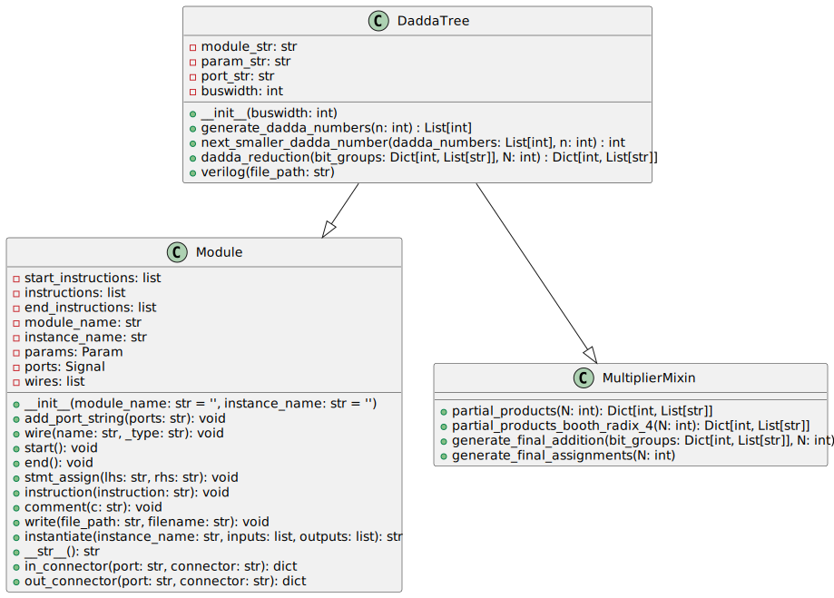

# Dadda multiplier

The Dadda multiplier is an efficient implementation of a digital multiplier based on a Dadda Tree reduction algorithm. This Python-based RTL generator creates a parameterized Verilog module that multiplies two binary numbers using the Dadda reduction technique.


## Overview

- **Module Name**: `math_multiplier_dadda_tree`
- **Parameter**: `N` - sets the bit width for the multiplier and multiplicand inputs.
- **Ports**:
  - `input [N-1:0] i_multiplier` - Multiplier input.
  - `input [N-1:0] i_multiplicand` - Multiplicand input.
  - `output [2*N-1:0] ow_product` - Product output of the multiplication.

## Code Details

### Class `DaddaTree`

This Python class inherits from both `Module` and `MultiplierMixin` and is responsible for creating a Verilog module that implements the Dadda Tree multiplier.

#### Constructor

```python
def __init__(self, buswidth): ...
```

- **Arguments**:
  - `buswidth` (int): The width of the bus for multiplier and multiplicand.
- **Functionality**: Sets up the module name, ports, and parameters based on the specified bus width.

#### Method `generate_dadda_numbers`

```python
@staticmethod
def generate_dadda_numbers(n=100): ...
```

- Generates a list of Dadda numbers used for the tree reduction.
- **Returns**: A list of integers representing the Dadda numbers.

#### Method `next_smaller_dadda_number`

```python
@staticmethod
def next_smaller_dadda_number(dadda_numbers, n): ...
```

- Finds the next smaller Dadda number in the list that is less than `n`.
- **Returns**: An integer representing the next smaller Dadda number.

#### Method `dadda_reduction`

```python
def dadda_reduction(self, bit_groups, N): ...
```

- Applies Dadda reduction to the bit groups by performing addition operations.
- **Inputs**:
  - `bit_groups`: A dictionary with indices mapping to lists of wire names representing the partial products.
  - `N`: The bus width provided when constructing the Dadda multiplier instance.
- **Returns**: A dictionary containing the reduced bit groups.

#### Method `verilog`

```python
def verilog(self, file_path): ...
```

- Generates the Verilog module implementation for the Dadda Tree multiplier.
- **Arguments**:
  - `file_path` (str): The path where the Verilog file should be saved.
- Writes the resulting Verilog module to the specified `file_path` with a `.sv` file extension.

---

The complete functionality of the Dadda multiplier requires integrating all these components to perform the desired bit-level multiplication. Additional helper methods and the `MultiplierMixin` class provide the necessary functionality for creating the Verilog code for partial products and the final additions.

---

[Back to Scripts Index](index.md)
