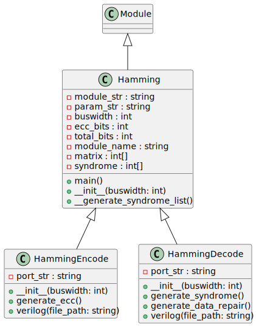

# Hamming Generator

High-level description of the Hamming Generator which includes classes for generating, encoding, and decoding Hamming codes for error detection and correction in digital systems. These classes calculate the necessary ECC bits and manage the overall structure of the code based on a given bus width.

## Code Documentation

The `Hamming` class serves as the base for creating Hamming codes. It calculates the necessary number of ECC (Error Correction Code) bits and determines the total number of bits for the code.

### Hamming Class

- Base class for Hamming code generation.
- Calculates ECC bits and total bits based on the data bus width.

### HammingEncode Class (extends `Hamming`)

- Encodes data using Hamming code.
- Generates error correction codes (ECC) based on provided data.

### HammingDecode Class (extends `Hamming`)

- Decodes data using Hamming code.
- Detects errors and repairs data if possible.

## Inputs and Outputs

### HammingEncode

- Inputs:
  - `i_data`: The original data to be encoded.
- Outputs:
  - `o_ecc`: The generated ECC for the input data.

### HammingDecode

- Inputs:
  - `i_data`: The original data to be checked and/or corrected.
  - `i_ecc`: The ECC that came with the data.
- Outputs:
  - `o_data`: The output data, corrected if there was an error.
  - `o_error`: Indicator if there was an error.
  - `o_repairable`: Indicates if the error could be repaired.

## Internal Functionality

- **Syndrome Calculation**: Both encoding and decoding involve calculating syndromes that help in determining the presence of errors.
- **ECC Generation**: The encode class includes methods to generate ECC based on the input data.
- **Error Detection and Correction**: The decode class includes methods to detect errors using syndromes and correct them if they are repairable.

---

[Back to Scripts Index](index.md)

---
