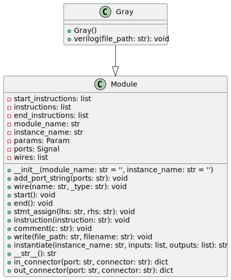

# Gray

The `Gray` class is a Python class intended for generating a SystemVerilog module for a portion of a Brent-Kung adder, specifically a Gray cell, which is used to perform fast binary addition. The class inherits from a `Module` base class, which is part of a larger library of RTL generator tools.

## Inputs / Outputs

- **i_g**: Input logic signal representing the generate signal for the current bit.
- **i_p**: Input logic signal representing the propagate signal for the current bit.
- **i_g_km1**: Input logic signal representing the generate signal for the previous bit (bit k minus 1).
- **ow_g**: Output logic signal representing the output generate signal post-computation.

## Internal Functionality

### Initialization (`__init__`)

Upon initialization, the `Gray` class calls the constructor of the `Module` base class with `module_name` set to the value of `module_str`, which is `'math_adder_brent_kung_gray'`. Additionally, the ports for the module are defined in `port_str` and added to the module by calling `add_port_string` method inherited from the `Module` base class.

### Verilog Code Generation (`verilog`)

The `verilog` method is where the SystemVerilog code for the Gray cell is actually generated.

- **Start**: Invokes the `start` method of the `Module` class to prepare for writing the SystemVerilog code.
- **Assignments**: The logic for the Gray cell is implemented with a single assignment statement connecting the inputs to the output `ow_g`. The Boolean expression `i_g | ( i_p & i_g_km1 )` represents the logic equation for the Gray cell operation within the Brent-Kung adder, which is used to calculate the carry-out signal.
- **End**: Invokes the `end` method of the `Module` class to finalize the SystemVerilog code.
- **Write File**: The generated code is written to a file whose path is defined by the `file_path` parameter and whose name is the `module_name` with a `.sv` extension.

### Command Line Options

Please note that there is no specific command line interface provided as part of this class; this code block appears to be part of a larger python script or application, which may have command-line interfaces defined elsewhere.

The usage of this class would involve instantiating an object of `Gray` and calling its `verilog` method, passing the directory path where the SystemVerilog file should be saved.

## SystemVerilog File Generation

The class generates a SystemVerilog file with the name based on `module_name` (`math_adder_brent_kung_gray.sv`) in the specified `file_path` directory. This file may then be included as part of a larger SystemVerilog design for a Brent-Kung adder.

## Dependencies

The class depends on a `Module` base class found in the `rtl_generators.verilog.module` module, which provides utilities to structure and write SystemVerilog modules. The document, however, does not provide the implementation of this base class.

---

[Back to Scripts Index](index.md)
