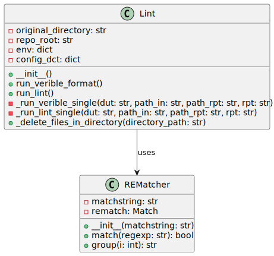

# lint

## Overview

The `lint` class in `./bin/project_automation/lint.py` is designed to perform linting and formatting on RTL (Register Transfer Level) code, specifically Verilog files, using a variety of tools such as Verible and Yosys. The class ensures that the code follows certain style guidelines and checks for typical coding mistakes.

## Class: Lint

### Description

The `Lint` class provides methods to run two main operations:

- Formatting Verilog files using Verible.
- Linting Verilog files using Verible's linter and Yosys.

The class maintains the directory structure for reports and uses a configuration file to manage the linting process.

### Attributes

- `original_directory (str)`: Stores the current working directory at the time the class is instantiated.
- `repo_root (str)`: The absolute path to the root directory of the repository.
- `env (dict)`: Environment variables including `REPO_ROOT`.
- `config_dct (dict)`: A dictionary containing configuration parameters read from a JSON file.

### Public Methods

#### `run_verible_format()`

Performs code formatting on Verilog files using Verible formatter, saving logs in a `format_logs` directory. It reads directories to format from a configuration file (`config.json`).

#### `run_lint()`

Runs the linting process on Verilog files using both Verible lint and Yosys lint tools. It stores the reports in the directories specified in the `config.json` file.

### Private Methods

#### `_run_verible_single(dut: str, path_in: str, path_rpt: str, rpt: str)`

Runs Verible lint on a single file. The parameters are: design under test (DUT) as `dut`, input path as `path_in`, report path as `path_rpt`, and report filename as `rpt`. Outputs are directed to a specified report file.

#### `_run_lint_single(dut: str, path_in: str, path_rpt: str, rpt: str)`

Performs linting using the Yosys tool on a single file with parameters similar to `_run_verible_single`. Outputs are directed to a specified report file.

#### `_delete_files_in_directory(directory_path)`

Deletes all files in the specified directory, used to clear out old reports before generating new ones.

### Command-line Options

No direct command-line options are implemented for the class methods as they seem to be intended for use within a Python environment. However, `subprocess.run` is used to execute shell commands, which are used to run external linting and formatting tools.

## Usage

The `Lint` class and its methods are likely intended to be invoked within a larger project automation system, possibly from a script that sets up the necessary environment and calls the appropriate methods based on project needs.

---

[Back to Scripts Index](index.md)
