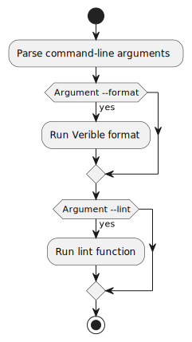

# lint_wrap

The `lint_wrap` script located at `lint_wrap.py` is designed to lint and format Verilog files using supporting functions encapsulated in a `Lint` class. This script acts as a command-line interface (CLI) utility for code maintenance purposes. The utility offers the option to either format the code, perform linting, or do both depending on the passed command-line arguments.


## Usage

The script provides two command-line options:

- `--format`: Formats Verilog files using the `run_verible_format()` method of the `Lint` class.
- `--lint`: Lints Verilog files using the `run_lint()` method of the `Lint` class.

When invoking this script from the command line, a user must specify at least one of the options above; if neither is specified, the script will display an error message prompting for one of the options.

## Code Dependencies and Execution Flow

This script is dependent on the following external modules and classes:

- `argparse` for parsing command-line arguments.
- `Lint` class from `project_automation.lint` module, presumably providing `run_verible_format()` and `run_lint()` methods to format and lint Verilog files, respectively.

The main function of the script performs the following steps:

1. Creates an `ArgumentParser` object with a description that explains the script's purpose.
2. Defines two mutually non-exclusive command-line arguments (`--format` and `--lint`).
3. Parses the command-line arguments.
4. Checks if at least one of the aforementioned arguments is present; if not, it displays an error message.
5. Creates a `Lint` object, presumably to handle formatting and linting operations.
6. Calls the `run_verible_format()` method of the `Lint` object if the `--format` argument is set.
7. Calls the `run_lint()` method of the `Lint` object if the `--lint` argument is set.

## Execution

To run this script, navigate to the directory containing `lint_wrap.py` and use one of the following command-line syntaxes depending on your requirements:

```sh
lint_wrap.py --format
lint_wrap.py --lint
lint_wrap.py --format --lint
```

Please ensure to replace `python3` with your specific Python version command if it differs.

## Internal Functionality

The script itself does not directly perform formatting or linting but rather delegates these tasks to the `Lint` class's methods. This kind of abstraction is beneficial as it allows for potential extensions of linting and formatting capabilities without modifying the CLI interface script.

**Note:** The script assumes the availability of the `project_automation.lint` module and the proper functioning of its `Lint` class, which are not defined in the provided context. For comprehensive usage, these dependencies should be properly installed and configured.

---

[Back to Scripts Index](index.md)
