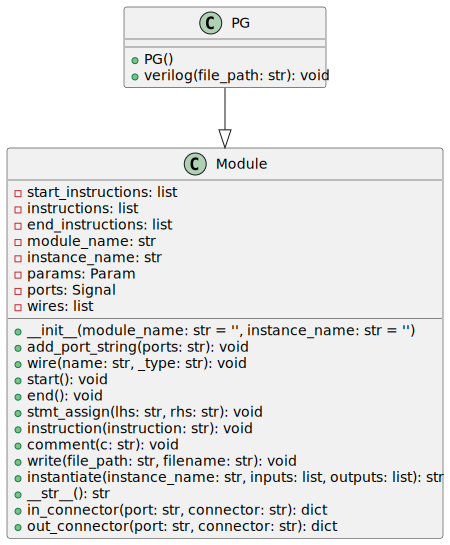

# pg

The `pg` module is specified in the file located at `rtl_generators/adders/brentkung/pg.py`. This module is implemented in Python and is part of a set of tools for generating Verilog code, particularly for arithmetic operations like addition using a Brent-Kung adder structure.


## Overview

The `PG` class is a derivative of a base `Module` class which provides a structure for defining a SystemVerilog module in the context of the Brent-Kung adder's propagate and generate (P & G) logic block.

## Inputs and Outputs

The `PG` module defines the following ports:

- `i_a`: An input signal representing the 'a' operand bit for P & G generation.
- `i_b`: An input signal representing the 'b' operand bit for P & G generation.
- `ow_g`: An output wire carrying the generate signal, which is high if both input bits `i_a` and `i_b` are high.
- `ow_p`: An output wire carrying the propagate signal, which is high if either input bit `i_a` or `i_b` is high.

## Functionality

When the `PG` class is instantiated, it initializes itself by calling the constructor of its parent class with the name of the module, which is `'math_adder_brent_kung_pg'`. During the generation of the Verilog code, the method `self.stmt_assign` is used to create assignments for the output wires `ow_g` and `ow_p`. The 'generate' output `ow_g` is the logical AND of the inputs, whereas the 'propagate' output `ow_p` is the logical XOR of the inputs.

## File Generation

The `verilog` method of the class takes the `file_path` as an argument. This method begins by invoking the `start` method to set up the initial structure of the Verilog module, then assigns the logical operations for `ow_g` and `ow_p`, concludes the module with the `end` method, and finally writes the output to a file with a name constructed from the module name and having a `.sv` extension, typically indicating a SystemVerilog file.

## Example Usage

To generate the Verilog file for the `PG` block, one would instantiate the `PG` class and call the `verilog` method with the desired output file path.

```python
pg_gen = PG()
pg_gen.verilog('/path/to/output/directory')
```

After this Python code is executed, the `math_adder_brent_kung_pg.sv` file will be created at the designated `/path/to/output/directory` with the appropriate Verilog code for the PG logic block.

---

[Back to Scripts Index](index.md)
