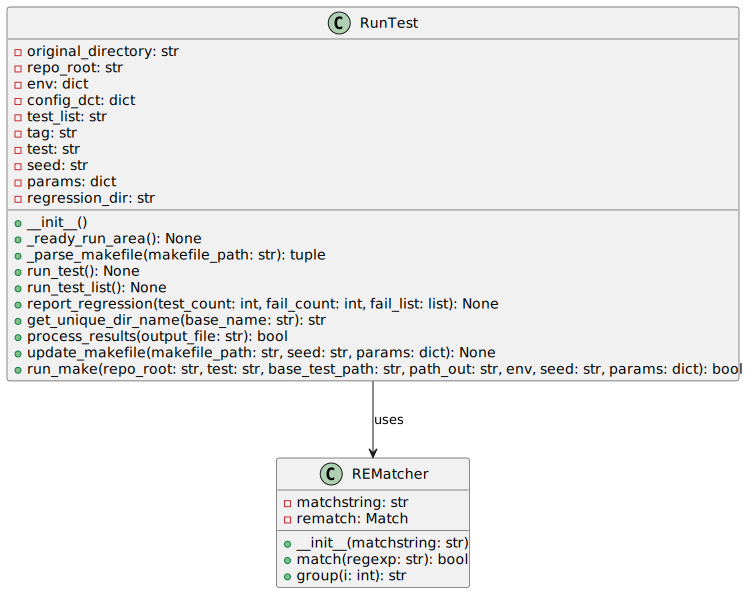

# run_test

`run_test.py` is a Python script responsible for automating the process of running tests and reporting regression test results in a project. This script is part of the `project_automation` directory and works primarily with regression testing. Below is the detailed documentation of the script.


## RunTest Class

The `RunTest` class encapsulates all the necessary details and methods to run individual tests or a list of tests along with reporting facilities.

### Initialization

`RunTest` requires certain parameters to initialize:

- `test`: The name of the individual test to run.
- `test_list`: The name of the test list file which contains multiple tests.
- `tag`: Tag for the regression test run.
- `seed`: Seed value used during the tests for deterministic behaviors.
- `params`: Custom parameters that may impact the test run.

Upon initialization, it sets up the testing environment by determining the repository root, copying necessary configuration files, and creating a unique directory for test results.

#### Example of Initialization

```python
instance = RunTest(test="my_test", test_list="test_list", tag="runtest", seed="12345", params={"param1": "value1", "param2": "value2"})
```

### Methods

#### `_ready_run_area`

Sets up the directory where the regression test will run.

#### `_parse_makefile`

Extracts parameters like `SEED` and `COMPILE_ARGS` from a given Makefile.

#### `run_test`

Executes an individual test, sets up the environment, and reports the result.

#### `run_test_list`

Executes a list of tests defined in a JSON file, then aggregates and reports results.

#### `report_regression`

Generates and prints a report summarizing the test run, including number of tests run, passed, and failed.

#### `get_unique_dir_name`

Generates a unique directory name to avoid conflicts with existing directories.

#### `process_results`

Processes output file to determine if the tests passed.

#### `update_makefile`

Updates the makefile based on provided seed and parameters before running a test.

#### `run_make`

Executes a make command to actually run the test based on the provided environment and parameters.

## How to Use

Run the module as a script with the necessary command line options. It can execute a single test or a list of tests depending on the provided arguments.

## Required External Files

- `config.json`: Contains project-wide configuration options.
- Test list JSON file: Defines which tests to run and their parameters, if running a list of tests.

---

[Back to Scripts Index](index.md)
