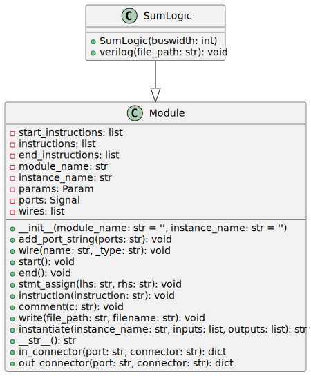

# sum_logic

The `sum_logic` module is part of a collection of Python scripts used to generate Verilog code for various hardware designs. Specifically, this Python module is used to generate the sum logic component of a Brent-Kung adder, which is a type of parallel prefix adder known for its logarithmic depth in terms of logic gates.



## Python Code Documentation

The Python code provided below is meant to be executed to create a hardware description of the sum logic in SystemVerilog. The script is part of the repository located at `RTL_Design_Projects/tools/rtl_generators/`.

### Dependencies

The script requires the `verilog` module, more precisely `Module` class from the file `verilog_parser.py` located in the `base_path` directory.

### Inputs/Outputs

#### Inputs

- **i_p**: Carry propagate signal, `logic` array with `N+1` bits (`N:0`).
- **i_gg**: Carry generate signal, `logic` array with `N+1` bits (`N:0`).

#### Outputs

- **ow_sum**: The sum output, `logic` array with `N` bits (`N-1:0`).
- **ow_carry**: The carry output, single `logic` bit.

### Internal Functionality

The `SumLogic` class inherits from the `Module` class and is used to generate the SystemVerilog representation of the sum logic component. The `buswidth` parameter, passed during initialization, defines the bit-width of the input and output ports.

The `verilog()` method takes a `file_path` as its argument and writes the generated Verilog code to the specified location as a `.sv` file. The code includes:

- A `generate` loop using a genvar `k` to produce an XOR operation between the carry generate signal `i_gg` and the carry propagate signal `i_p` bit by bit, producing the `ow_sum` signal.
- Assignment of the highest bit of the carry generate signal `i_gg` to produce the `ow_carry` signal.

### Command Line Options

This Python code does not explicitly handle command line options within the presented block. To utilize this script, it needs to be imported and called from another Python module that handles command-line arguments or used within an existing Python script setup.

## Sample Usage

To use this code, you might have a separate Python script that sets up the required parameters, calls the `SumLogic` class, passes the appropriate `buswidth`, and specifies where to output the generated `.sv` file.

Here's a hypothetical example of how you might set up another Python module to use `SumLogic`:

```python
from sum_logic import SumLogic

# Define the bitwidth for the adder
adder_bitwidth = 8

# Instance of the SumLogic class
sum_logic_generator = SumLogic(adder_bitwidth)

# Path to output the generated SystemVerilog code
output_path = "./generated_sv"

# Generate the SystemVerilog code for the sum logic
sum_logic_generator.verilog(output_path)
```

The `verilog` method of the `SumLogic` class is responsible for writing the Verilog code to the file system.

---

[Back to Scripts Index](index.md)
