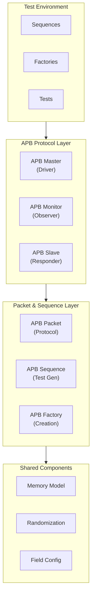

<!-- RTL Design Sherpa Documentation Header -->
<table>
<tr>
<td width="80">
  <a href="https://github.com/sean-galloway/RTLDesignSherpa">
    
  </a>
</td>
<td>
  <strong>RTL Design Sherpa</strong> · <em>Learning Hardware Design Through Practice</em><br>
  <sub>
    <a href="https://github.com/sean-galloway/RTLDesignSherpa">GitHub</a> ·
    <a href="https://github.com/sean-galloway/RTLDesignSherpa/blob/main/docs/DOCUMENTATION_INDEX.md">Documentation Index</a> ·
    <a href="https://github.com/sean-galloway/RTLDesignSherpa/blob/main/LICENSE">MIT License</a>
  </sub>
</td>
</tr>
</table>

---

<!-- End Header -->

# APB Components Overview

The APB (Advanced Peripheral Bus) components provide a complete verification environment for the APB protocol, part of the ARM AMBA specification. These components are designed for testing APB masters, slaves, and interconnects with comprehensive transaction monitoring and stimulus generation.

## Architecture Overview

The APB components follow a layered architecture for protocol verification:



## Component Categories

### 🎯 **Protocol Implementation**
Core APB protocol components that handle signal-level communication:

- **APBMaster**: Drives APB transactions with configurable timing
- **APBSlave**: Responds to APB transactions with memory backing
- **APBMonitor**: Observes and logs APB protocol activity

**Key Features:**
- Full APB signal support (PSEL, PENABLE, PWRITE, PADDR, etc.)
- Configurable data and address widths
- Memory model integration for realistic slave behavior
- Comprehensive error injection and handling
- Timing randomization for stress testing

### 📦 **Packet & Transaction Management**
High-level transaction abstraction for test stimulus:

- **APBPacket**: Protocol-specific packet with APB fields
- **APBTransaction**: Randomized transaction generator
- **APBSequence**: Test pattern and sequence management

**Key Features:**
- Object-oriented transaction handling
- Built-in randomization with constraints
- Flexible sequence generation (burst, alternating, stress)
- Automatic field validation and formatting
- Support for read-modify-write operations

### 🏭 **Factory Functions & Utilities**
Simplified component creation and configuration:

- **Component Factories**: Easy creation of masters, slaves, monitors
- **Sequence Factories**: Pre-built test patterns and sequences
- **Register Testing**: Specialized register verification functions
- **System Integration**: Complete testbench setup utilities

**Key Features:**
- One-line component creation with sensible defaults
- Pre-configured test sequences for common scenarios
- Register map integration for systematic testing
- Automatic component interconnection

## APB Protocol Support

### Protocol Features
- **APB2/APB3 Compatibility**: Support for basic and extended APB
- **Signal Coverage**: All standard and optional APB signals
- **Error Handling**: PSLVERR generation and detection
- **Protection**: PPROT support for security testing
- **Strobes**: PSTRB support for partial data transfers

### Supported Operations
- **Basic Read/Write**: Single register access patterns
- **Burst Operations**: Sequential address testing
- **Error Injection**: Slave error and decode error simulation
- **Timing Stress**: Configurable ready delays and hold times
- **Register Testing**: Walking patterns, field access, reset verification

### Signal Mapping

| APB Master Signals | Direction | APB Slave Signals | Direction |
|--------------------|-----------|-------------------|-----------|
| PSEL | out | PSEL | in |
| PENABLE | out | PENABLE | in |
| PWRITE | out | PWRITE | in |
| PADDR | out | PADDR | in |
| PWDATA | out | PWDATA | in |
| PSTRB | out | PSTRB | in |
| PPROT | out | PPROT | in |
| PRDATA | in | PRDATA | out |
| PREADY | in | PREADY | out |
| PSLVERR | in | PSLVERR | out |

## Design Principles

### 1. **Ease of Use**
- Factory functions provide one-line component creation
- Sensible defaults for all configuration parameters
- Automatic signal mapping and width configuration
- Pre-built test sequences for common scenarios

### 2. **Flexibility**
- Configurable data and address widths (8-bit to 64-bit+)
- Pluggable randomization engines
- Customizable timing and error injection
- Support for both directed and constrained random testing

### 3. **Realism**
- Memory model backing for slave responses
- Configurable ready delays and error conditions
- Support for partial data transfers with strobes
- Protocol violation detection and reporting

### 4. **Performance**
- Efficient transaction queuing and pipelining
- Optimized signal handling and updates
- Minimal simulation overhead
- Fast transaction generation and processing

## Usage Patterns

### Basic Testbench Setup

```python
import cocotb
from CocoTBFramework.components.apb import *

@cocotb.test()
async def basic_apb_test(dut):
    # Create components
    master = create_apb_master(dut, "APB_Master", "apb_", dut.clk)
    slave = create_apb_slave(dut, "APB_Slave", "apb_", dut.clk, registers=1024)
    monitor = create_apb_monitor(dut, "APB_Monitor", "apb_", dut.clk)
    
    # Create test sequence
    sequence = create_apb_sequence(pattern="alternating", num_regs=10)
    
    # Run test
    for packet in sequence:
        await master.send(packet)
```

### Advanced Register Testing

```python
# Create register-specific test sequence
reg_map = create_register_map(base_addr=0x1000, registers={...})
sequence = create_register_test_sequence(reg_map, test_type="walk")

# Run functional test
functional_sequence = create_sequence_from_tuples(
    reg_map, 
    [("CONFIG_REG", "ENABLE", 1), ("STATUS_REG", "MODE", 2)]
)
```

### Stress Testing

```python
# Create stress test with randomization
stress_sequence = create_apb_sequence(
    pattern="stress", 
    num_regs=100,
    randomize_delays=True
)

# Configure timing randomization
master.set_randomizer(FlexRandomizer({
    'psel': ([[0, 0], [1, 10]], [7, 1]),
    'penable': ([[0, 0], [1, 5]], [8, 1])
}))
```

## Integration with Framework

### Shared Components Integration
- **Memory Model**: Realistic slave memory backing
- **FlexRandomizer**: Advanced randomization for timing and data
- **Field Configuration**: Flexible packet field definitions
- **Statistics**: Performance and error tracking
- **Scoreboards**: Transaction checking and verification

### Protocol Independence
- Uses shared packet infrastructure for consistency
- Leverages common randomization and memory components
- Integrates with framework-wide scoreboard and monitoring
- Compatible with other protocol components for mixed testing

## Key Features

### Transaction Management
- **Automatic Queuing**: Transaction pipelining and flow control
- **Timing Control**: Configurable delays and randomization
- **Error Injection**: Comprehensive error scenario testing
- **Data Patterns**: Walking, alternating, and stress patterns

### Memory Integration
- **Memory Model**: NumPy-backed high-performance memory
- **Register Maps**: Integration with register specifications
- **Access Tracking**: Read/write operation monitoring
- **Coverage Analysis**: Memory access coverage reporting

### Verification Support
- **Protocol Checking**: APB specification compliance
- **Transaction Monitoring**: Complete protocol observation
- **Error Detection**: Slave errors and protocol violations
- **Performance Analysis**: Timing and throughput metrics

## Testing Capabilities

### Functional Testing
- Basic read/write operations
- Register field access and modification
- Error condition handling
- Reset and initialization sequences

### Stress Testing
- Back-to-back transactions
- Random timing injection
- Maximum throughput testing
- Corner case exploration

### Register Testing
- Walking ones/zeros patterns
- Field-level access verification
- Read-modify-write operations
- Reset value validation

### Protocol Testing
- Signal timing verification
- Error response validation
- Protection attribute testing
- Strobe pattern verification

## Getting Started

### Quick Setup
1. **Import Components**: `from CocoTBFramework.components.apb import *`
2. **Create Master/Slave**: Use factory functions with DUT signals
3. **Generate Sequence**: Use built-in patterns or custom sequences
4. **Run Test**: Send packets and monitor responses

### Advanced Usage
1. **Custom Randomization**: Configure FlexRandomizer for specific patterns
2. **Register Integration**: Import register maps for systematic testing
3. **Error Injection**: Configure slave error scenarios
4. **Performance Analysis**: Use statistics and monitoring components

Each component includes comprehensive examples and documentation for integration into verification environments, from simple directed tests to complex randomized stress testing scenarios.