<!-- RTL Design Sherpa Documentation Header -->
<table>
<tr>
<td width="80">
  <a href="https://github.com/sean-galloway/RTLDesignSherpa">
    
  </a>
</td>
<td>
  <strong>RTL Design Sherpa</strong> · <em>Learning Hardware Design Through Practice</em><br>
  <sub>
    <a href="https://github.com/sean-galloway/RTLDesignSherpa">GitHub</a> ·
    <a href="https://github.com/sean-galloway/RTLDesignSherpa/blob/main/docs/DOCUMENTATION_INDEX.md">Documentation Index</a> ·
    <a href="https://github.com/sean-galloway/RTLDesignSherpa/blob/main/LICENSE">MIT License</a>
  </sub>
</td>
</tr>
</table>

---

<!-- End Header -->

# AXI4 Components Overview

The CocoTBFramework AXI4 components provide comprehensive support for AXI4-Full protocol verification and transaction generation. Built on the proven GAXI infrastructure, these components offer a consistent and powerful interface for memory-mapped protocol testing with advanced features for burst transactions, outstanding operations, and protocol compliance verification.

## Framework Integration

### GAXI Infrastructure Foundation

The AXI4 components inherit from the robust GAXI framework, providing:

**Unified Field Configuration**: Complete integration with the CocoTBFramework field configuration system for flexible transaction structures
**Memory Model Support**: Seamless integration with memory models for data verification and complex test scenarios
**Statistics Integration**: Comprehensive performance metrics and transaction tracking
**Signal Resolution**: Automatic signal detection and mapping across different naming conventions
**Advanced Debugging**: Multi-level debugging capabilities with detailed transaction logging

### Memory-Mapped Protocol Specialization

While inheriting GAXI's power, AXI4 components are specifically optimized for memory-mapped protocols:

**Five Channel Architecture**: Complete support for AR, R, AW, W, and B channels
**Burst Transaction Management**: Native support for INCR, FIXED, and WRAP burst types
**Outstanding Transaction Support**: Advanced management of multiple concurrent transactions
**Address and Data Decoupling**: Independent address and data phases for maximum throughput
**Protocol Compliance**: Integrated compliance checking for AXI4 specification adherence

## Core Components Architecture

```mermaid
graph TB
    subgraph Ecosystem["AXI4 Component Ecosystem"]
        subgraph Components["Core Components"]
            MasterRd["AXI4MasterRd<br/>(AR/R)"]
            MasterWr["AXI4MasterWr<br/>(AW/W/B)"]
            SlaveRd["AXI4SlaveRd<br/>(AR/R)"]
            SlaveWr["AXI4SlaveWr<br/>(AW/W/B)"]
        end

        subgraph FieldConfig["AXI4 Field Configurations"]
            AR[AR Config]
            R[R Config]
            AW[AW Config]
            W[W Config]
            B[B Config]
        end

        subgraph Advanced["Advanced AXI4 Features"]
            Compliance[Compliance]
            Random[Randomization]
            Timing[Timing Config]
            Factories[Factories]
            PktUtils[Packet Utils]
            TxnSupport[Transaction Support]
        end

        subgraph GAXI["GAXI Infrastructure"]
            SigRes[Signal Resolution]
            MemModels[Memory Models]
            Stats[Statistics]
            FieldHandle[Field Handling]
            Debug[Debug Support]
            Config[Configuration]
        end
    end

    Components --> FieldConfig
    FieldConfig --> Advanced
    Advanced --> GAXI
```



## Component Capabilities

### AXI4MasterRead - Memory Read Operations

The `AXI4MasterRead` component drives AXI4 read transactions as a master:

**Address Request Management**:
- **AR Channel Control**: Complete AWADDR, AWLEN, AWSIZE, AWBURST, AWID management
- **Outstanding Transactions**: Support for multiple concurrent read requests
- **Address Alignment**: Automatic address alignment and burst boundary checking
- **QoS and Caching**: Complete AWQOS, AWCACHE, AWPROT, AWREGION support

**Read Data Reception**:
- **R Channel Monitoring**: Automatic RDATA, RRESP, RID, RLAST processing
- **Burst Assembly**: Automatic assembly of multi-beat read bursts
- **Error Handling**: Complete RRESP error detection and reporting
- **Flow Control**: Intelligent RREADY backpressure management

**Performance Features**:
- **Pipeline Optimization**: Overlapped address and data phases
- **Memory Integration**: Direct memory model integration for verification
- **Statistics Tracking**: Real-time performance monitoring and analysis

### AXI4MasterWrite - Memory Write Operations

The `AXI4MasterWrite` component drives AXI4 write transactions as a master:

**Address and Data Management**:
- **AW Channel Control**: Complete AWADDR, AWLEN, AWSIZE, AWBURST management
- **W Channel Control**: WDATA, WSTRB, WLAST, WID coordination
- **Address/Data Synchronization**: Proper ordering of address and data phases
- **Write Strobes**: Byte-level write enable control

**Write Response Handling**:
- **B Channel Processing**: Automatic BRESP, BID response verification
- **Error Detection**: Complete write response error handling
- **Transaction Completion**: Proper write transaction lifecycle management

**Advanced Write Features**:
- **Partial Writes**: WSTRB-based partial word writing
- **Write Ordering**: Support for write ordering requirements
- **Outstanding Management**: Multiple concurrent write transaction support

### AXI4SlaveRead - Memory Read Response

The `AXI4SlaveRead` component responds to AXI4 read transactions as a slave:

**Address Processing**:
- **AR Channel Monitoring**: Automatic read address request detection
- **Address Decode**: Configurable address range checking and routing
- **Burst Analysis**: ARLEN, ARSIZE, ARBURST parameter processing
- **QoS Processing**: ARQOS, ARCACHE, ARPROT parameter handling

**Data Response Generation**:
- **R Channel Control**: RDATA, RRESP, RID, RLAST generation
- **Memory Interface**: Direct memory model integration for data sourcing
- **Error Injection**: Configurable SLVERR, DECERR response generation
- **Timing Control**: Configurable RVALID timing and latency

**Slave-Specific Features**:
- **Address Range Configuration**: Flexible address space definition
- **Response Randomization**: Realistic slave timing behavior
- **Protocol Compliance**: Automatic AXI4 slave protocol adherence

### AXI4SlaveWrite - Memory Write Response

The `AXI4SlaveWrite` component responds to AXI4 write transactions as a slave:

**Write Transaction Processing**:
- **AW/W Channel Coordination**: Proper address and data phase synchronization
- **Write Data Assembly**: Multi-beat burst data collection and assembly
- **Strobe Processing**: WSTRB-based byte-level write processing
- **Write Ordering**: Support for write ordering and hazard detection

**Write Response Generation**:
- **B Channel Control**: BRESP, BID response generation
- **Error Response**: Configurable error condition simulation
- **Response Timing**: Realistic write response latency modeling

**Memory Integration Features**:
- **Write-Through**: Direct memory model updates
- **Write Verification**: Automatic write data validation
- **Conflict Detection**: Write hazard and ordering conflict detection

## Field Configuration System

### AXI4FieldConfigs - Channel-Specific Configuration

The field configuration system enables flexible AXI4 parameter adaptation:

**Channel-Specific Configurations**:
```python
# AR Channel Configuration
ar_config = AXI4FieldConfigHelper.create_ar_field_config(
    id_width=8, addr_width=32, user_width=1
)

# AW Channel Configuration
aw_config = AXI4FieldConfigHelper.create_aw_field_config(
    id_width=8, addr_width=32, user_width=1
)

# R Channel Configuration
r_config = AXI4FieldConfigHelper.create_r_field_config(
    id_width=8, data_width=32, user_width=1
)

# W Channel Configuration
w_config = AXI4FieldConfigHelper.create_w_field_config(
    data_width=32, user_width=1
)

# B Channel Configuration
b_config = AXI4FieldConfigHelper.create_b_field_config(
    id_width=8, user_width=1
)
```

**Flexible Parameter Support**:
- **Variable Widths**: Support for different data, address, and ID widths
- **Optional Signals**: Proper handling of zero-width USER, QOS, REGION signals
- **Custom Extensions**: Support for proprietary sideband signals

## Advanced Features

### AXI4ComplianceChecker - Protocol Verification

The integrated compliance checker provides comprehensive AXI4 specification verification:

**Transaction-Level Checking**:
- **Handshake Protocol**: VALID/READY signal timing verification
- **Burst Compliance**: AWLEN, ARLEN, *LAST signal consistency
- **Address Alignment**: Burst boundary and size alignment checking
- **ID Consistency**: Transaction ID matching across channels

**System-Level Monitoring**:
- **Outstanding Limits**: Maximum outstanding transaction enforcement
- **Ordering Requirements**: Read/write ordering rule verification
- **Deadlock Detection**: System-level deadlock condition monitoring
- **Performance Analysis**: Bus utilization and efficiency metrics

### AXI4Randomization - Realistic Test Scenarios

The randomization system provides comprehensive parameter variation:

**Transaction Randomization**:
```python
# Configure address randomization
randomizer.configure_address_range(0x1000, 0x8000)
randomizer.configure_burst_length(1, 16)
randomizer.configure_burst_types(['INCR', 'WRAP'])

# Configure timing randomization
randomizer.configure_valid_delays(min=0, max=5)
randomizer.configure_ready_delays(min=0, max=3)

# Configure ID randomization
randomizer.configure_id_pool([1, 2, 3, 4, 5])
```

**Data Pattern Generation**:
- **Pseudorandom Data**: LFSR-based data pattern generation
- **Address-Based Patterns**: Data values derived from address
- **Custom Patterns**: User-defined data generation algorithms
- **Error Injection**: Controlled error condition insertion

## Usage Patterns and Integration

### Basic Read Transaction

```python
# Create AXI4 master read interface
master_read = AXI4MasterRead(
    dut=dut,
    clock=clk,
    prefix="m_axi_",
    data_width=32,
    id_width=8,
    addr_width=32
)

# Perform single read
data = await master_read.read_transaction(
    address=0x1000,
    burst_len=1,
    id=1
)

# Perform burst read
burst_data = await master_read.read_transaction(
    address=0x2000,
    burst_len=8,
    id=2,
    burst_type=1,  # INCR
    size=2         # 4-byte transfers
)
```

### Basic Write Transaction

```python
# Create AXI4 master write interface
master_write = AXI4MasterWrite(
    dut=dut,
    clock=clk,
    prefix="m_axi_",
    data_width=32,
    id_width=8,
    addr_width=32
)

# Perform single write
await master_write.write_transaction(
    address=0x1000,
    data=[0x12345678],
    id=1
)

# Perform burst write with strobes
await master_write.write_transaction(
    address=0x2000,
    data=[0xDEADBEEF, 0xCAFEBABE, 0xFEEDFACE],
    strb=[0xF, 0xC, 0x3],  # Different byte enables
    id=2,
    burst_type=1  # INCR
)
```

### Memory Model Integration

```python
# Create memory model
memory = create_memory_model(size=4096, data_width=32)

# Connect to components
master_write.connect_memory(memory)
slave_read.connect_memory(memory)

# Automatic verification
await master_write.write_transaction(0x1000, [0x12345678])
read_data = await slave_read.read_response(0x1000, 1)
assert read_data[0] == 0x12345678  # Automatic verification
```

### Outstanding Transaction Management

```python
# Configure outstanding transaction limits
master_read.configure_outstanding(max_ar_outstanding=4, max_r_outstanding=8)

# Launch concurrent transactions
import asyncio

async def concurrent_reads():
    tasks = []
    for i in range(4):
        task = master_read.read_transaction(
            address=0x1000 + i*0x100,
            burst_len=4,
            id=i
        )
        tasks.append(asyncio.create_task(task))

    results = await asyncio.gather(*tasks)
    return results

read_results = await concurrent_reads()
```

## Performance Optimization

### Pipeline Control

**Address/Data Overlap**:
- **Write Channel Coordination**: AW and W channel timing optimization
- **Read Pipeline**: AR and R channel pipeline management
- **Outstanding Balance**: Optimal outstanding transaction configuration

**Flow Control Optimization**:
- **Backpressure Management**: Intelligent READY signal timing
- **Throughput Maximization**: Minimal bubble insertion strategies
- **Latency Minimization**: Optimized handshake timing

### Memory Efficiency

**Transaction Batching**:
- **Burst Optimization**: Automatic burst size and alignment optimization
- **Outstanding Queuing**: Efficient outstanding transaction queue management
- **Data Caching**: Smart data caching for repetitive patterns

## Debug and Analysis

### Comprehensive Logging

**Transaction Tracing**:
- **Channel-Level Logging**: Detailed per-channel transaction logging
- **Timing Analysis**: Handshake timing and pipeline analysis
- **Protocol Compliance**: Real-time compliance violation reporting
- **Performance Metrics**: Throughput and latency measurement

**Integration Tools**:
- **Waveform Annotation**: Automatic transaction marker generation
- **Coverage Integration**: Direct integration with functional coverage
- **Debug Interfaces**: Integration with external debug tools

## Configuration Examples

### Hardware Parameter Matching

```python
# Match SystemVerilog AXI4 interface parameters
# parameter AXI_DATA_WIDTH = 64,
# parameter AXI_ADDR_WIDTH = 40,
# parameter AXI_ID_WIDTH = 4,
# parameter AXI_USER_WIDTH = 0

master_read = AXI4MasterRead(
    dut=dut,
    clock=clk,
    prefix="m_axi_",
    data_width=64,
    addr_width=40,
    id_width=4,
    user_width=0  # Disabled user signals
)
```

### Protocol Variant Support

```python
# AXI4-Lite configuration (single transaction, no bursts)
axi4_lite_config = {
    'data_width': 32,
    'addr_width': 32,
    'id_width': 0,      # No ID signals
    'user_width': 0,    # No USER signals
    'burst_support': False,  # Single transactions only
    'outstanding_limit': 1   # Single outstanding transaction
}

# Custom AXI4 variant
custom_config = {
    'data_width': 512,   # Wide data bus
    'addr_width': 48,    # Extended addressing
    'id_width': 16,      # Many outstanding transactions
    'user_width': 32,    # Rich sideband data
    'qos_support': True, # Quality of Service
    'region_support': True  # Memory regions
}
```

The AXI4 components provide a comprehensive, high-performance, and flexible solution for AXI4-Full protocol verification, combining the power of the GAXI infrastructure with AXI4-specific optimizations and advanced features for complete memory-mapped interface testing.