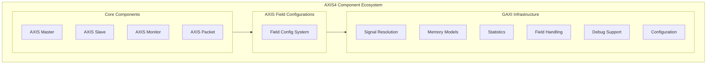

<!-- RTL Design Sherpa Documentation Header -->
<table>
<tr>
<td width="80">
  <a href="https://github.com/sean-galloway/RTLDesignSherpa">
    
  </a>
</td>
<td>
  <strong>RTL Design Sherpa</strong> · <em>Learning Hardware Design Through Practice</em><br>
  <sub>
    <a href="https://github.com/sean-galloway/RTLDesignSherpa">GitHub</a> ·
    <a href="https://github.com/sean-galloway/RTLDesignSherpa/blob/main/docs/DOCUMENTATION_INDEX.md">Documentation Index</a> ·
    <a href="https://github.com/sean-galloway/RTLDesignSherpa/blob/main/LICENSE">MIT License</a>
  </sub>
</td>
</tr>
</table>

---

<!-- End Header -->

# AXIS4 Components Overview

The CocoTBFramework AXIS4 components provide comprehensive support for AXI4-Stream protocol verification and transaction generation. Built on the proven GAXI infrastructure, these components offer a consistent and powerful interface for stream protocol testing with advanced features for packet-based data flows, flow control, and protocol compliance verification.

## Framework Integration

### GAXI Infrastructure Foundation

The AXIS4 components inherit from the robust GAXI framework, providing:

**Unified Field Configuration**: Complete integration with the CocoTBFramework field configuration system for flexible packet structures
**Memory Model Support**: Seamless integration with memory models for data verification and complex test scenarios
**Statistics Integration**: Comprehensive performance metrics and transaction tracking
**Signal Resolution**: Automatic signal detection and mapping across different naming conventions
**Advanced Debugging**: Multi-level debugging capabilities with detailed transaction logging

### Stream Protocol Specialization

While inheriting GAXI's power, AXIS4 components are specifically optimized for stream protocols:

**Single Channel Architecture**: Focused on the T (Transfer) channel with TVALID/TREADY handshaking
**Packet Boundary Management**: Native support for TLAST signaling and frame/packet boundaries
**Flow Control**: Advanced backpressure handling and throughput optimization
**Sideband Signal Support**: Complete support for TID, TDEST, TUSER, TSTRB, and TKEEP signals

## Core Components Architecture



## Component Capabilities

### AXISMaster - Stream Data Generation

The `AXISMaster` component drives AXI4-Stream protocol as a master (source):

**Stream Generation**:
- **Packet-Based Transmission**: Support for variable-length packets with TLAST boundaries
- **Flow Control**: Intelligent handling of TREADY backpressure
- **Burst Modes**: Support for continuous streaming and burst transmission patterns
- **Randomization**: Configurable timing randomization for realistic test scenarios

**Advanced Features**:
- **Multi-Stream Support**: TID-based stream identification and routing
- **Destination Routing**: TDEST-based packet routing capabilities
- **User Data Channels**: TUSER sideband data transmission
- **Byte-Level Control**: TSTRB and TKEEP byte-level data control

**Performance Optimization**:
- **Pipeline Optimization**: Advanced pipeline control for maximum throughput
- **Memory Integration**: Direct memory model integration for data pattern generation
- **Statistics Tracking**: Real-time performance monitoring and bottleneck identification

### AXISSlave - Stream Data Reception

The `AXISSlave` component receives AXI4-Stream protocol as a slave (sink):

**Stream Reception**:
- **Automatic Handshaking**: Intelligent TVALID/TREADY protocol handling
- **Packet Assembly**: Automatic packet boundary detection using TLAST
- **Flow Control**: Configurable backpressure generation and timing
- **Data Validation**: Built-in data integrity checking and protocol compliance

**Advanced Capabilities**:
- **Stream Demultiplexing**: TID-based stream separation and processing
- **Address-Based Routing**: TDEST-based packet classification
- **User Data Processing**: TUSER data extraction and validation
- **Byte-Level Analysis**: TSTRB/TKEEP pattern analysis and validation

**Memory Integration**:
- **Automatic Storage**: Direct memory model integration for received data
- **Pattern Checking**: Automatic comparison with expected data patterns
- **Coverage Analysis**: Transaction coverage tracking and gap analysis

### AXISMonitor - Protocol Analysis

The `AXISMonitor` component provides comprehensive protocol monitoring and analysis:

**Protocol Compliance**:
- **Signal Timing**: TVALID/TREADY timing relationship verification
- **Protocol Violations**: Detection of AXI4-Stream specification violations
- **Packet Structure**: TLAST placement and packet boundary analysis
- **Sideband Validation**: TID, TDEST, TUSER consistency checking

**Performance Analysis**:
- **Throughput Measurement**: Real-time bandwidth calculation and trending
- **Latency Analysis**: Transaction latency distribution and statistical analysis
- **Backpressure Tracking**: TREADY assertion patterns and impact analysis
- **Utilization Metrics**: Channel efficiency and idle time analysis

**Advanced Monitoring**:
- **Multi-Stream Tracking**: Per-TID stream analysis and correlation
- **Error Classification**: Detailed error categorization and root cause analysis
- **Coverage Collection**: Functional coverage collection and reporting
- **Debug Integration**: Integration with waveform viewers and debug tools

### AXISPacket - Data Structure Management

The `AXISPacket` class provides comprehensive packet management:

**Field Access**:
- **Unified Interface**: Consistent field access across all AXIS signals
- **Type Safety**: Automatic type checking and field validation
- **Dynamic Configuration**: Runtime field configuration and mapping
- **Legacy Compatibility**: Support for existing GAXI-based test infrastructure

**Data Management**:
- **Efficient Storage**: Optimized data structures for high-performance simulation
- **Serialization**: Automatic conversion between packet objects and wire formats
- **Validation**: Built-in field range and consistency checking
- **Transformation**: Easy conversion between different packet formats

## Field Configuration System

### AXISFieldConfigs - Protocol Adaptation

The field configuration system enables flexible protocol adaptation:

**Signal Mapping**:
```python
# Example AXIS field configuration
axis_config = AXISFieldConfigs()
axis_config.set_data_width(32)
axis_config.set_id_width(8)
axis_config.set_dest_width(4)
axis_config.set_user_width(16)
```

**Flexible Width Support**:
- **Dynamic Width Configuration**: Support for variable data, ID, and user widths
- **Zero-Width Handling**: Proper handling of optional signals (TID=0, TDEST=0, etc.)
- **Byte Enable Support**: Automatic TSTRB width calculation based on data width
- **Keep Signal Support**: TKEEP signal configuration for sparse data transmission

## Usage Patterns and Integration

### Basic Stream Testing

```python
# Create AXIS components
master = AXISMaster(dut, "StreamSource", "m_axis_", clk)
slave = AXISSlave(dut, "StreamSink", "s_axis_", clk)
monitor = AXISMonitor(dut, "StreamMon", "s_axis_", clk)

# Configure stream properties
master.configure_stream(data_width=32, id_width=8, dest_width=4)

# Generate stream packets
packet = master.create_packet(data=0x12345678, last=True, id=5, dest=2)
await master.send_packet(packet)

# Monitor stream activity
received_packets = await monitor.wait_for_packets(count=1)
```

### Memory Model Integration

```python
# Create memory model for data verification
memory = create_memory_model(size=1024, data_width=32)

# Connect memory to AXIS components
master.connect_memory(memory, base_address=0x1000)
slave.connect_memory(memory, base_address=0x2000)

# Automatic data generation and verification
await master.generate_random_stream(packet_count=100, max_packet_size=64)
verification_results = slave.verify_memory_consistency()
```

### Multi-Stream Scenarios

```python
# Configure multi-stream environment
master.configure_streams(stream_count=4, id_width=8)

# Generate concurrent streams
for stream_id in range(4):
    stream_config = {
        'id': stream_id,
        'dest': stream_id % 2,
        'packet_size_range': (16, 256),
        'packet_count': 50
    }
    await master.generate_stream(stream_config)

# Monitor and analyze per-stream performance
stream_stats = monitor.get_per_stream_statistics()
```

## Advanced Features

### Performance Optimization

**Pipeline Control**:
- **Bubble Insertion**: Controlled pipeline bubbles for timing closure verification
- **Throughput Optimization**: Automatic optimization of TVALID/TREADY timing
- **Backpressure Patterns**: Realistic backpressure pattern generation
- **Load Balancing**: Multi-master coordination for load distribution

**Memory Efficiency**:
- **Streaming Mode**: Low-memory streaming for large data sets
- **Compression**: Automatic data compression for repetitive patterns
- **Caching**: Intelligent caching of frequently accessed data
- **Zero-Copy**: Direct memory access for maximum performance

### Debug and Analysis

**Comprehensive Logging**:
- **Transaction Tracing**: Detailed per-transaction logging with timing information
- **Protocol Analysis**: Real-time protocol compliance checking
- **Performance Profiling**: Bottleneck identification and optimization suggestions
- **Error Reporting**: Detailed error analysis with root cause identification

**Integration Tools**:
- **Waveform Annotation**: Automatic waveform marker generation
- **Coverage Integration**: Direct integration with functional coverage tools
- **Assertion Support**: Built-in assertion monitoring and reporting
- **Debug Interfaces**: Integration with external debug and analysis tools

## Configuration and Customization

### Field Configuration Examples

```python
# Basic AXIS configuration
config = AXISFieldConfigs()
config.configure_basic_stream(data_width=64, id_width=0)

# Advanced configuration with all sideband signals
config.configure_advanced_stream(
    data_width=128,
    id_width=16,
    dest_width=8,
    user_width=32,
    enable_keep=True,
    enable_strb=True
)

# Custom field mapping for non-standard signal names
config.map_signals({
    'tdata': 'stream_data',
    'tvalid': 'data_valid',
    'tready': 'data_ready',
    'tlast': 'end_of_packet'
})
```

### Protocol Customization

**Custom Extensions**:
- **Proprietary Sideband**: Support for custom sideband signals
- **Protocol Variants**: Adaptation for protocol variations and extensions
- **Custom Validation**: User-defined validation rules and checkers
- **Integration Hooks**: Callbacks for custom processing and analysis

## Statistics and Monitoring

### Statistics Key Structure

AXIS4 components provide comprehensive statistics through a hierarchical key structure. When accessing statistics, use robust key access patterns to handle different component types:

```python
# Get statistics from any AXIS component
stats = component.get_stats()

# For received packets (slaves and monitors):
packets_received = stats.get('received_transactions',
                             stats.get('slave_stats', {}).get('received_transactions',
                                      stats.get('packets_received', 0)))

# For sent packets (masters):
packets_sent = stats.get('transactions_sent',
                        stats.get('master_stats', {}).get('transactions_sent',
                                 stats.get('packets_sent', 0)))

# For observed packets (monitors):
packets_observed = stats.get('transactions_observed',
                            stats.get('monitor_stats', {}).get('transactions_observed',
                                     stats.get('packets_observed', 0)))
```

**Key Statistics Structure**:
- `received_transactions` - Packets received by slave components
- `transactions_sent` - Packets sent by master components
- `transactions_observed` - Packets observed by monitor components
- `protocol_violations` - Protocol compliance violations detected
- `total_data_bytes` - Total bytes transferred
- `frames_sent/received` - Complete frames (TLAST boundaries)

### Best Practices

**Robust Statistics Access**: Always use `.get()` with fallbacks to handle different component implementations and avoid KeyError exceptions.

**Timing Considerations**: For deep skid buffers (depth > 4), allow timing tolerance in monitor assertions due to pipeline effects.

**Clock Gating**: Clock gated tests may have slightly lower success rates due to timing complexity - adjust thresholds accordingly.

The AXIS4 components provide a comprehensive, high-performance, and flexible solution for AXI4-Stream protocol verification, combining the power of the GAXI infrastructure with stream-specific optimizations and features.